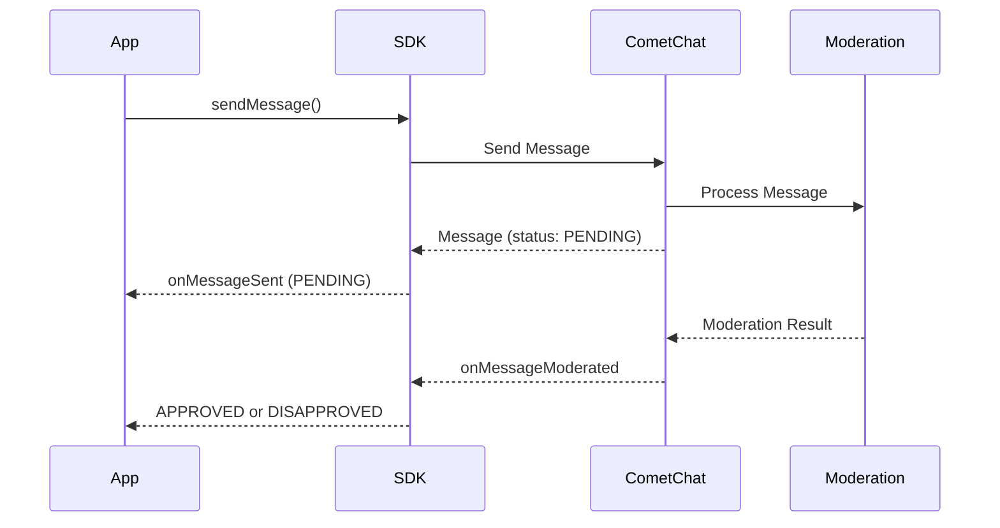

## Overview

AI Moderation in the CometChat SDK helps ensure that your chat application remains safe and compliant by automatically reviewing messages for inappropriate content. This feature leverages AI to moderate messages in real-time, reducing manual intervention and improving user experience.

<Note>
For a broader understanding of moderation features, configuring rules, and managing flagged messages, see the [Moderation Overview](/moderation/overview).
</Note>

## Prerequisites

Before using AI Moderation, ensure the following:

1. Moderation is enabled for your app in the [CometChat Dashboard](https://app.cometchat.com)
2. Moderation rules are configured under **Moderation > Rules**
3. You're using CometChat SDK version that supports moderation

## How It Works



| Step | Description |
|------|-------------|
| 1. Send Message | App sends a text, image, or video message |
| 2. Pending Status | Message is sent with `PENDING` moderation status |
| 3. AI Processing | Moderation service analyzes the content |
| 4. Result Event | `onMessageModerated` event fires with final status |

## Supported Message Types

Moderation is triggered **only** for the following message types:

| Message Type | Moderated | Notes |
|--------------|-----------|-------|
| Text Messages | ✅ | Content analyzed for inappropriate text |
| Image Messages | ✅ | Images scanned for unsafe content |
| Video Messages | ✅ | Videos analyzed for prohibited content |
| Custom Messages | ❌ | Not subject to AI moderation |
| Action Messages | ❌ | Not subject to AI moderation |

## Moderation Status

The `getModerationStatus()` method returns one of the following values:

| Status | Enum Value | Description |
|--------|------------|-------------|
| Pending | `CometChat.ModerationStatus.PENDING` | Message is being processed by moderation |
| Approved | `CometChat.ModerationStatus.APPROVED` | Message passed moderation and is visible |
| Disapproved | `CometChat.ModerationStatus.DISAPPROVED` | Message violated rules and was blocked |

## Implementation

### Step 1: Send a Message and Check Initial Status

When you send a text, image, or video message, check the initial moderation status:

<Tabs>
  <Tab title="JavaScript">
    ```javascript
    const textMessage = new CometChat.TextMessage(
      receiverUID,
      "Hello, how are you?",
      CometChat.RECEIVER_TYPE.USER
    );

    CometChat.sendMessage(textMessage).then(
      (message) => {
        // Check moderation status
        const status = message.getModerationStatus();
        
        if (status === CometChat.ModerationStatus.PENDING) {
          console.log("Message is under moderation review");
          // Show pending indicator in UI
        }
      },
      (error) => {
        console.log("Message sending failed:", error);
      }
    );
    ```
  </Tab>
  <Tab title="TypeScript">
    ```typescript
    const textMessage = new CometChat.TextMessage(
      receiverUID,
      "Hello, how are you?",
      CometChat.RECEIVER_TYPE.USER
    );

    CometChat.sendMessage(textMessage).then(
      (message: CometChat.TextMessage) => {
        // Check moderation status
        const status: string = message.getModerationStatus();
        
        if (status === CometChat.ModerationStatus.PENDING) {
          console.log("Message is under moderation review");
          // Show pending indicator in UI
        }
      },
      (error: CometChat.CometChatException) => {
        console.log("Message sending failed:", error);
      }
    );
    ```
  </Tab>
</Tabs>

### Step 2: Listen for Moderation Results

Register a message listener to receive moderation results in real-time:

<Tabs>
  <Tab title="JavaScript">
    ```javascript
    const listenerID = "MODERATION_LISTENER";

    CometChat.addMessageListener(
      listenerID,
      new CometChat.MessageListener({
        onMessageModerated: (message) => {
          if (
            message instanceof CometChat.TextMessage ||
            message instanceof CometChat.MediaMessage
          ) {
            const status = message.getModerationStatus();
            const messageId = message.getId();

            switch (status) {
              case CometChat.ModerationStatus.APPROVED:
                console.log(`Message ${messageId} approved`);
                // Update UI to show message normally
                break;

              case CometChat.ModerationStatus.DISAPPROVED:
                console.log(`Message ${messageId} blocked`);
                // Handle blocked message (hide or show warning)
                handleDisapprovedMessage(message);
                break;
            }
          }
        }
      })
    );

    // Don't forget to remove the listener when done
    // CometChat.removeMessageListener(listenerID);
    ```
  </Tab>
  <Tab title="TypeScript">
    ```typescript
    const listenerID: string = "MODERATION_LISTENER";

    CometChat.addMessageListener(
      listenerID,
      new CometChat.MessageListener({
        onMessageModerated: (message: CometChat.BaseMessage) => {
          if (
            message instanceof CometChat.TextMessage ||
            message instanceof CometChat.MediaMessage
          ) {
            const status: string = message.getModerationStatus();
            const messageId: number = message.getId();

            switch (status) {
              case CometChat.ModerationStatus.APPROVED:
                console.log(`Message ${messageId} approved`);
                // Update UI to show message normally
                break;

              case CometChat.ModerationStatus.DISAPPROVED:
                console.log(`Message ${messageId} blocked`);
                // Handle blocked message (hide or show warning)
                handleDisapprovedMessage(message);
                break;
            }
          }
        }
      })
    );

    // Don't forget to remove the listener when done
    // CometChat.removeMessageListener(listenerID);
    ```
  </Tab>
</Tabs>

### Step 3: Handle Disapproved Messages

When a message is disapproved, you should handle it appropriately in your UI:

```javascript
function handleDisapprovedMessage(message) {
  const messageId = message.getId();
  
  // Option 1: Hide the message completely
  hideMessageFromUI(messageId);
  
  // Option 2: Show a placeholder message
  showBlockedPlaceholder(messageId, "This message was blocked by moderation");
  
  // Option 3: Notify the sender (if it's their message)
  if (message.getSender().getUid() === currentUserUID) {
    showNotification("Your message was blocked due to policy violation");
  }
}
```

## Complete Example

Here's a complete implementation showing the full moderation flow:

<Tabs>
  <Tab title="JavaScript">
    ```javascript
    class ModerationHandler {
      constructor() {
        this.pendingMessages = new Map();
        this.setupListener();
      }

      setupListener() {
        CometChat.addMessageListener(
          "MODERATION_LISTENER",
          new CometChat.MessageListener({
            onMessageModerated: (message) => this.onModerated(message)
          })
        );
      }

      async sendMessage(receiverUID, text) {
        const textMessage = new CometChat.TextMessage(
          receiverUID,
          text,
          CometChat.RECEIVER_TYPE.USER
        );

        try {
          const message = await CometChat.sendMessage(textMessage);
          const status = message.getModerationStatus();

          if (status === CometChat.ModerationStatus.PENDING) {
            // Track pending message
            this.pendingMessages.set(message.getId(), message);
            return { success: true, pending: true, message };
          }

          return { success: true, pending: false, message };
        } catch (error) {
          return { success: false, error };
        }
      }

      onModerated(message) {
        const messageId = message.getId();
        const status = message.getModerationStatus();

        // Remove from pending
        this.pendingMessages.delete(messageId);

        // Emit event for UI update
        this.emit("moderationResult", {
          messageId,
          status,
          approved: status === CometChat.ModerationStatus.APPROVED,
          message
        });
      }

      cleanup() {
        CometChat.removeMessageListener("MODERATION_LISTENER");
      }
    }

    // Usage
    const handler = new ModerationHandler();
    const result = await handler.sendMessage("user123", "Hello!");

    if (result.pending) {
      console.log("Message pending moderation...");
    }
    ```
  </Tab>
</Tabs>

## Best Practices

<AccordionGroup>
  <Accordion title="Show pending state in UI">
    Display a visual indicator (like a clock icon or "Reviewing..." text) for messages with `PENDING` status so users know their message is being processed.
  </Accordion>
  <Accordion title="Handle disapproved messages gracefully">
    Don't just hide blocked messages silently. Inform the sender that their message couldn't be delivered due to content policy, without revealing specific details about what triggered the block.
  </Accordion>
  <Accordion title="Cache moderation status">
    Store the moderation status locally so you don't need to re-check when displaying message history.
  </Accordion>
  <Accordion title="Clean up listeners">
    Always remove message listeners when components unmount or when they're no longer needed to prevent memory leaks.
  </Accordion>
</AccordionGroup>

## Related Features

<CardGroup cols={2}>
  <Card title="Flag Message" icon="flag" href="/sdk/javascript/flag-message">
    Allow users to manually report inappropriate messages
  </Card>
  <Card title="Moderation Overview" icon="shield" href="/moderation/overview">
    Configure moderation rules and manage flagged messages
  </Card>
  <Card title="Flagged Messages" icon="list" href="/moderation/flagged-messages">
    Review and manage messages flagged by users or AI
  </Card>
  <Card title="Message Listeners" icon="headphones" href="/sdk/javascript/message-listeners">
    Learn more about real-time message events
  </Card>
</CardGroup>

## FAQ

<AccordionGroup>
  <Accordion title="How long does moderation take?">
    AI moderation typically processes messages within a few seconds. However, processing time may vary based on content type (images and videos take longer than text) and server load.
  </Accordion>
  <Accordion title="What happens if the moderation service is unavailable?">
    If the moderation service is temporarily unavailable, messages may remain in `PENDING` status longer than usual. The SDK will deliver the moderation result once the service processes the message.
  </Accordion>
  <Accordion title="Can users appeal a disapproved message?">
    The SDK doesn't provide a built-in appeal mechanism. However, you can implement a custom workflow using the [Flag Message](/sdk/javascript/flag-message) feature or by contacting your support team through the Dashboard.
  </Accordion>
  <Accordion title="Does moderation work offline?">
    No, AI moderation requires an active connection to CometChat servers. Messages sent while offline will be moderated when they're synced after reconnection.
  </Accordion>
</AccordionGroup>
