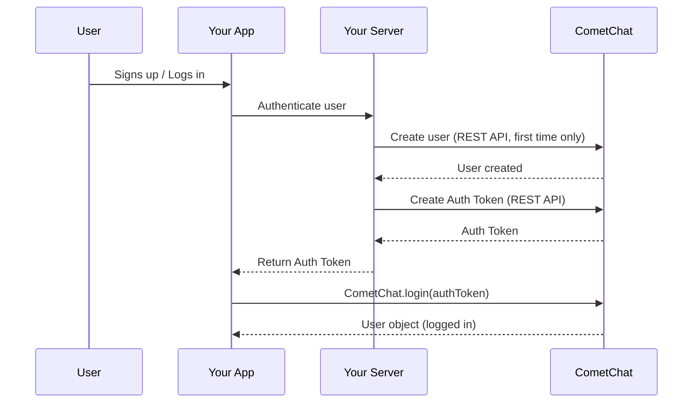

{/* TL;DR for Agents and Quick Reference */}
<Accordion title="AI Integration Quick Reference">

```javascript
// Check existing session
const user = await CometChat.getLoggedinUser();

// Login with Auth Key (development only)
CometChat.login("cometchat-uid-1", "AUTH_KEY").then(user => console.log("Logged in:", user));

// Login with Auth Token (production)
CometChat.login("AUTH_TOKEN").then(user => console.log("Logged in:", user));

// Logout
CometChat.logout().then(() => console.log("Logged out"));
```

**Create users via:** [Dashboard](https://app.cometchat.com) (testing) | [REST API](https://api-explorer.cometchat.com/reference/creates-user) (production)
**Test UIDs:** `cometchat-uid-1` through `cometchat-uid-5`
</Accordion>

After [initializing](/sdk/javascript/initialization) the SDK, the next step is to authenticate your user. CometChat provides two login methods — Auth Key for quick development, and Auth Token for production — both accessed through the `login()` method.

### How It Works



## Before You Log In

### Create a User

A user must exist in CometChat before they can log in.

- **During development:** Create users from the [CometChat Dashboard](https://app.cometchat.com). Five test users are already available with UIDs `cometchat-uid-1` through `cometchat-uid-5`.
- **In production:** Call the [Create User REST API](https://api-explorer.cometchat.com/reference/creates-user) when a user signs up in your app.

You can also create users from the client side using `createUser()` (development only):

<Tabs>
<Tab title="TypeScript">
```typescript
let authKey: string = "AUTH_KEY";
let uid: string = "user1";
let name: string = "Kevin";

let user: CometChat.User = new CometChat.User(uid);
user.setName(name);

CometChat.createUser(user, authKey).then(
  (user: CometChat.User) => {
    console.log("User created:", user);
  },
  (error: CometChat.CometChatException) => {
    console.log("Error:", error);
  }
);
```
</Tab>
<Tab title="JavaScript">
```javascript
let authKey = "AUTH_KEY";
let uid = "user1";
let name = "Kevin";

let user = new CometChat.User(uid);
user.setName(name);

CometChat.createUser(user, authKey).then(
  (user) => {
    console.log("User created:", user);
  },
  (error) => {
    console.log("Error:", error);
  }
);
```
</Tab>
</Tabs>

<Warning>
`createUser()` with Auth Key is for development only. In production, create users server-side via the [REST API](https://api-explorer.cometchat.com/reference/creates-user). See [User Management](/sdk/javascript/user-management) for full details.
</Warning>

### Check for an Existing Session

The SDK persists the logged-in user's session locally. Before calling `login()`, always check whether a session already exists — this avoids unnecessary login calls and keeps your app responsive.

```javascript
const user = await CometChat.getLoggedinUser();
if (user) {
  // User is already logged in — proceed to your app
}
```

If `getLoggedinUser()` returns `null`, no active session exists and you need to call `login()`.

## Login with Auth Key

Auth Key login is the simplest way to get started. Pass a UID and your Auth Key directly from the client.

<Warning>
Auth Keys are meant for development and testing only. For production, use [Auth Token login](#login-with-auth-token) instead. Never ship Auth Keys in client-side code.
</Warning>

<Tabs>
<Tab title="TypeScript">
```typescript
const UID: string = "cometchat-uid-1";
const authKey: string = "AUTH_KEY";

CometChat.getLoggedinUser().then(
  (user: CometChat.User) => {
    if (!user) {
      CometChat.login(UID, authKey).then(
        (user: CometChat.User) => {
          console.log("Login Successful:", { user });
        },
        (error: CometChat.CometChatException) => {
          console.log("Login failed with exception:", { error });
        }
      );
    }
  },
  (error: CometChat.CometChatException) => {
    console.log("Some Error Occurred", { error });
  }
);
```
</Tab>

<Tab title="JavaScript">
```javascript
const UID = "cometchat-uid-1";
const authKey = "AUTH_KEY";

CometChat.getLoggedinUser().then(
  (user) => {
    if (!user) {
      CometChat.login(UID, authKey).then(
        (user) => {
          console.log("Login Successful:", { user });
        },
        (error) => {
          console.log("Login failed with exception:", { error });
        }
      );
    }
  },
  (error) => {
    console.log("Some Error Occurred", { error });
  }
);
```
</Tab>

<Tab title="Async/Await">
```javascript
const UID = "cometchat-uid-1";
const authKey = "AUTH_KEY";

try {
  const loggedInUser = await CometChat.getLoggedinUser();
  if (!loggedInUser) {
    const user = await CometChat.login(UID, authKey);
    console.log("Login Successful:", { user });
  }
} catch (error) {
  console.log("Login failed with exception:", { error });
}
```
</Tab>
</Tabs>

| Parameter | Description |
| --------- | ----------- |
| UID | The UID of the user to log in |
| authKey | Your CometChat Auth Key |

On success, the `Promise` resolves with a [`User`](/sdk/reference/entities#user) object containing the logged-in user's details.

## Login with Auth Token

Auth Token login keeps your Auth Key off the client entirely. Your server generates a token via the REST API and passes it to the client.

1. [Create the user](https://api-explorer.cometchat.com/reference/creates-user) via the REST API when they sign up (first time only).
2. [Generate an Auth Token](https://api-explorer.cometchat.com/reference/create-authtoken) on your server and return it to the client.
3. Pass the token to `login()`.

<Tabs>
<Tab title="TypeScript">
```typescript
const authToken: string = "AUTH_TOKEN";

CometChat.getLoggedinUser().then(
  (user: CometChat.User) => {
    if (!user) {
      CometChat.login(authToken).then(
        (user: CometChat.User) => {
          console.log("Login Successful:", { user });
        },
        (error: CometChat.CometChatException) => {
          console.log("Login failed with exception:", { error });
        }
      );
    }
  },
  (error: CometChat.CometChatException) => {
    console.log("Some Error Occurred", { error });
  }
);
```
</Tab>

<Tab title="JavaScript">
```javascript
const authToken = "AUTH_TOKEN";

CometChat.getLoggedinUser().then(
  (user) => {
    if (!user) {
      CometChat.login(authToken).then(
        (user) => {
          console.log("Login Successful:", { user });
        },
        (error) => {
          console.log("Login failed with exception:", { error });
        }
      );
    }
  },
  (error) => {
    console.log("Some Error Occurred", { error });
  }
);
```
</Tab>

<Tab title="Async/Await">
```javascript
const authToken = "AUTH_TOKEN";

try {
  const loggedInUser = await CometChat.getLoggedinUser();
  if (!loggedInUser) {
    const user = await CometChat.login(authToken);
    console.log("Login Successful:", { user });
  }
} catch (error) {
  console.log("Login failed with exception:", { error });
}
```
</Tab>
</Tabs>

| Parameter | Description |
| --------- | ----------- |
| authToken | Auth Token generated on your server for the user |

On success, the `Promise` resolves with a [`User`](/sdk/reference/entities#user) object containing the logged-in user's details.

## Logout

Call `logout()` when your user logs out of your app. This clears the local session.

<Tabs>
<Tab title="TypeScript">
```typescript
CometChat.logout().then(
  (loggedOut: Object) => {
    console.log("Logout completed successfully");
  },
  (error: CometChat.CometChatException) => {
    console.log("Logout failed with exception:", { error });
  }
);
```
</Tab>

<Tab title="JavaScript">
```javascript
CometChat.logout().then(
  () => {
    console.log("Logout completed successfully");
  },
  (error) => {
    console.log("Logout failed with exception:", { error });
  }
);
```
</Tab>

<Tab title="Async/Await">
```javascript
try {
  await CometChat.logout();
  console.log("Logout completed successfully");
} catch (error) {
  console.log("Logout failed with exception:", { error });
}
```
</Tab>
</Tabs>

---

## Login Listener

You can listen for login and logout events in real time using `LoginListener`. This is useful for updating UI state or triggering side effects when the auth state changes.

| Callback | Description |
| --- | --- |
| `loginSuccess(event)` | User logged in successfully. Provides the [`User`](/sdk/reference/entities#user) object. |
| `loginFailure(event)` | Login failed. Provides a [`CometChatException`](/sdk/reference/auxiliary#cometchatexception). |
| `logoutSuccess()` | User logged out successfully. |
| `logoutFailure(event)` | Logout failed. Provides a [`CometChatException`](/sdk/reference/auxiliary#cometchatexception). |

### Add a Listener

<Tabs>
<Tab title="TypeScript">
```typescript
const listenerID: string = "UNIQUE_LISTENER_ID";
CometChat.addLoginListener(
    listenerID,
    new CometChat.LoginListener({
        loginSuccess: (user: CometChat.User) => {
            console.log("LoginListener :: loginSuccess", user);
        },
        loginFailure: (error: CometChat.CometChatException) => {
            console.log("LoginListener :: loginFailure", error);
        },
        logoutSuccess: () => {
            console.log("LoginListener :: logoutSuccess");
        },
        logoutFailure: (error: CometChat.CometChatException) => {
            console.log("LoginListener :: logoutFailure", error);
        }
    })
);
```
</Tab>

<Tab title="JavaScript">
```javascript
let listenerID = "UNIQUE_LISTENER_ID";
CometChat.addLoginListener(
    listenerID,
    new CometChat.LoginListener({
        loginSuccess: (e) => {
            console.log("LoginListener :: loginSuccess", e);
        },
        loginFailure: (e) => {
            console.log("LoginListener :: loginFailure", e);
        },
        logoutSuccess: () => {
            console.log("LoginListener :: logoutSuccess");
        },
        logoutFailure: (e) => {
            console.log("LoginListener :: logoutFailure", e);
        }
    })
);
```
</Tab>
</Tabs>

### Remove a Listener

```javascript
CometChat.removeLoginListener("UNIQUE_LISTENER_ID");
```

<Warning>
Always remove login listeners when they're no longer needed (e.g., on component unmount or page navigation). Failing to remove listeners can cause memory leaks and duplicate event handling.
</Warning>

---

## Next Steps

<CardGroup cols={2}>
  <Card title="Send Messages" icon="paper-plane" href="/sdk/javascript/send-message">
    Send your first text, media, or custom message
  </Card>
  <Card title="User Management" icon="users-gear" href="/sdk/javascript/user-management">
    Create, update, and delete users programmatically
  </Card>
  <Card title="Connection Status" icon="signal" href="/sdk/javascript/connection-status">
    Monitor the SDK connection state in real time
  </Card>
  <Card title="All Real-Time Listeners" icon="tower-broadcast" href="/sdk/javascript/all-real-time-listeners">
    Complete reference for all SDK event listeners
  </Card>
</CardGroup>
