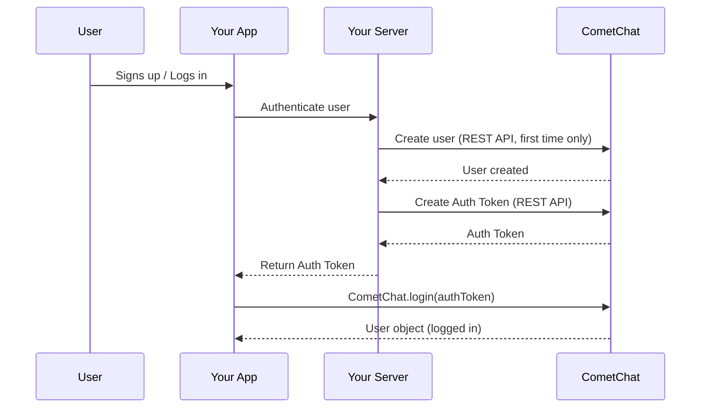

{/* TL;DR for Agents and Quick Reference */}
<Accordion title="AI Integration Quick Reference">

```javascript
// Check existing session
const user = await CometChat.getLoggedinUser();

// Login with Auth Key (development only)
CometChat.login("UID", "AUTH_KEY").then(user => console.log("Logged in:", user));

// Login with Auth Token (production)
CometChat.login("AUTH_TOKEN").then(user => console.log("Logged in:", user));

// Logout
CometChat.logout().then(() => console.log("Logged out"));
```

**Create users via:** [Dashboard](https://app.cometchat.com) (testing) | [REST API](https://api-explorer.cometchat.com/reference/creates-user) (production)
**Test UIDs:** `cometchat-uid-1` through `cometchat-uid-5`
</Accordion>

## Create User

Before you log in a user, you must add the user to CometChat.

1. **For proof of concept/MVPs**: Create the user using the [CometChat Dashboard](https://app.cometchat.com).
2. **For production apps**: Use the CometChat [Create User API](https://api-explorer.cometchat.com/reference/creates-user) to create the user when your user signs up in your app.

### Authentication Flow



<Note>

We have setup 5 users for testing having UIDs: `cometchat-uid-1`, `cometchat-uid-2`, `cometchat-uid-3`, `cometchat-uid-4` and `cometchat-uid-5`.

</Note>

Once initialization is successful, you will need to log the user into CometChat using the `login()` method.

We recommend you call the CometChat login method once your user logs into your app. The `login()` method needs to be called only once.

<Warning>

The CometChat SDK maintains the session of the logged-in user within the SDK. Thus you do not need to call the login method for every session. You can use the CometChat.getLoggedinUser() method to check if there is any existing session in the SDK. This method should return the details of the logged-in user. If this method returns null, it implies there is no session present within the SDK and you need to log the user into CometChat.

</Warning>

## Login using Auth Key

This straightforward authentication method is ideal for proof-of-concept (POC) development or during the early stages of application development. For production environments, however, we strongly recommend using an [AuthToken](#login-using-auth-token) instead of an Auth Key to ensure enhanced security.

<Warning>
**Auth Key** is for development/testing only. In production, generate **Auth Tokens** on your server using the REST API and pass them to the client. Never expose Auth Keys in production client code.
</Warning>

<Tabs>
<Tab title="TypeScript">
```typescript
const UID: string = "cometchat-uid-1";
const authKey: string = "AUTH_KEY";

CometChat.getLoggedinUser().then(
  (user: CometChat.User) => {
    if (!user) {
      CometChat.login(UID, authKey).then(
        (user: CometChat.User) => {
          console.log("Login Successful:", { user });
        },
        (error: CometChat.CometChatException) => {
          console.log("Login failed with exception:", { error });
        }
      );
    }
  },
  (error: CometChat.CometChatException) => {
    console.log("Some Error Occurred", { error });
  }
);
```

</Tab>

<Tab title="JavaScript">
```js
const UID = "cometchat-uid-1";
const authKey = "AUTH_KEY";

CometChat.getLoggedinUser().then(
  (user) => {
    if (!user) {
      CometChat.login(UID, authKey).then(
        (user) => {
          console.log("Login Successful:", { user });
        },
        (error) => {
          console.log("Login failed with exception:", { error });
        }
      );
    }
  },
  (error) => {
    console.log("Some Error Occurred", { error });
  }
);
```

</Tab>

<Tab title="Async/Await">
```javascript
const UID = "UID";
const authKey = "AUTH_KEY";

try {
  const loggedInUser = await CometChat.getLoggedinUser();
  if (!loggedInUser) {
    const user = await CometChat.login(UID, authKey);
    console.log("Login Successful:", { user });
  }
} catch (error) {
  console.log("Login failed with exception:", { error });
}
```

</Tab>

</Tabs>

| Parameters | Description                                      |
| ---------- | ------------------------------------------------ |
| UID        | The UID of the user that you would like to login |
| authKey    | CometChat Auth Key                               |

After the user logs in, their information is returned in the `User` object on `Promise` resolved.

## Login using Auth Token

This advanced authentication procedure does not use the Auth Key directly in your client code thus ensuring safety.

1. [Create a User](https://api-explorer.cometchat.com/reference/creates-user) via the CometChat API when the user signs up in your app.
2. [Create an Auth Token](https://api-explorer.cometchat.com/reference/create-authtoken) via the CometChat API for the new user and save the token in your database.
3. Load the Auth Token in your client and pass it to the `login()` method.

<Tabs>
<Tab title="TypeScript">
```typescript
const authToken: string = "AUTH_TOKEN";

CometChat.getLoggedinUser().then(
  (user: CometChat.User) => {
    if (!user) {
      CometChat.login(authToken).then(
        (user: CometChat.User) => {
          console.log("Login Successful:", { user });
        },
        (error: CometChat.CometChatException) => {
          console.log("Login failed with exception:", { error });
        }
      );
    }
  },
  (error: CometChat.CometChatException) => {
    console.log("Some Error Occurred", { error });
  }
);
```

</Tab>

<Tab title="JavaScript">
```js
const authToken = "AUTH_TOKEN";

CometChat.getLoggedinUser().then(
  (user) => {
    if (!user) {
      CometChat.login(authToken).then(
        (user) => {
          console.log("Login Successful:", { user });
        },
        (error) => {
          console.log("Login failed with exception:", { error });
        }
      );
    }
  },
  (error) => {
    console.log("Something went wrong", error);
  }
);
```

</Tab>

<Tab title="Async/Await">
```javascript
const authToken = "AUTH_TOKEN";

try {
  const loggedInUser = await CometChat.getLoggedinUser();
  if (!loggedInUser) {
    const user = await CometChat.login(authToken);
    console.log("Login Successful:", { user });
  }
} catch (error) {
  console.log("Login failed with exception:", { error });
}
```

</Tab>

</Tabs>

| Parameter | Description                                    |
| --------- | ---------------------------------------------- |
| authToken | Auth Token of the user you would like to login |

After the user logs in, their information is returned in the `User` object on the `Promise` resolved.

## Logout

You can use the `logout()` method to log out the user from CometChat. We suggest you call this method once your user has been successfully logged out from your app.

<Tabs>
<Tab title="TypeScript">
```typescript
CometChat.logout().then(
  (loggedOut: Object) => {
    console.log("Logout completed successfully");
  },
  (error: CometChat.CometChatException) => {
    console.log("Logout failed with exception:", { error });
  }
);
```

</Tab>

<Tab title="JavaScript">
```js
CometChat.logout().then(
  () => {
    console.log("Logout completed successfully");
  },
  (error) => {
    console.log("Logout failed with exception:", { error });
  }
);
```

</Tab>

<Tab title="Async/Await">
```javascript
try {
  await CometChat.logout();
  console.log("Logout completed successfully");
} catch (error) {
  console.log("Logout failed with exception:", { error });
}
```

</Tab>

</Tabs>

---

## Login Listener

The CometChat SDK provides real-time updates for `login` and `logout` events via the `LoginListener` class.

| Delegate Method | Description |
| --- | --- |
| `loginSuccess(event)` | User logged in successfully. Provides the `User` object. |
| `loginFailure(event)` | Login failed. Provides a `CometChatException`. |
| `logoutSuccess()` | User logged out successfully. |
| `logoutFailure(event)` | Logout failed. Provides a `CometChatException`. |

### Add Login Listener

<Tabs>
<Tab title="TypeScript">
```typescript
const listenerID: string = "UNIQUE_LISTENER_ID";
CometChat.addLoginListener(
    listenerID,
    new CometChat.LoginListener({
        loginSuccess: (user: CometChat.User) => {
            console.log("LoginListener :: loginSuccess", user);
        },
        loginFailure: (error: CometChat.CometChatException) => {
            console.log("LoginListener :: loginFailure", error);
        },
        logoutSuccess: () => {
            console.log("LoginListener :: logoutSuccess");
        },
        logoutFailure: (error: CometChat.CometChatException) => {
            console.log("LoginListener :: logoutFailure", error);
        }
    })
);
```

</Tab>

<Tab title="JavaScript">
```js
let listenerID = "UNIQUE_LISTENER_ID";
CometChat.addLoginListener(
    listenerID,
    new CometChat.LoginListener({
        loginSuccess: (e) => {
            console.log("LoginListener :: loginSuccess", e);
        },
        loginFailure: (e) => {
            console.log("LoginListener :: loginFailure", e);
        },
        logoutSuccess: () => {
            console.log("LoginListener :: logoutSuccess");
        },
        logoutFailure: (e) => {
            console.log("LoginListener :: logoutFailure", e);
        }
    })
);
```

</Tab>

</Tabs>

### Remove Login Listener

<Tabs>
<Tab title="TypeScript">
```typescript
const listenerID: string = "UNIQUE_LISTENER_ID";
CometChat.removeLoginListener(listenerID);
```

</Tab>

<Tab title="JavaScript">
```js
const listenerID = "UNIQUE_LISTENER_ID";
CometChat.removeLoginListener(listenerID);
```

</Tab>

</Tabs>

<Warning>
Always remove login listeners when they're no longer needed (e.g., on component unmount or page navigation). Failing to remove listeners can cause memory leaks and duplicate event handling.
</Warning>

---

## Next Steps

<CardGroup cols={2}>
  <Card title="Send Messages" icon="paper-plane" href="/sdk/javascript/send-message">
    Send your first text, media, or custom message
  </Card>
  <Card title="User Management" icon="users-gear" href="/sdk/javascript/user-management">
    Create, update, and delete users programmatically
  </Card>
  <Card title="Connection Status" icon="signal" href="/sdk/javascript/connection-status">
    Monitor the SDK connection state in real time
  </Card>
  <Card title="All Real-Time Listeners" icon="tower-broadcast" href="/sdk/javascript/all-real-time-listeners">
    Complete reference for all SDK event listeners
  </Card>
</CardGroup>
