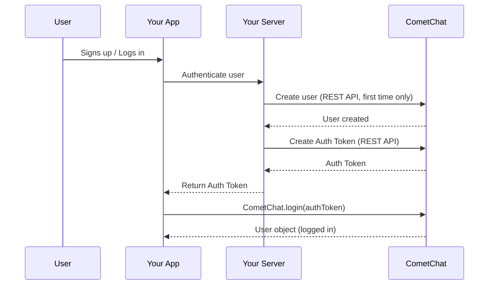

{/* TL;DR for Agents and Quick Reference */}
<Info>
**Quick Reference for AI Agents & Developers**

```javascript
// Check existing session
const user = await CometChat.getLoggedinUser();

// Login with Auth Key (development only)
CometChat.login("UID", "AUTH_KEY").then(user => console.log("Logged in:", user));

// Login with Auth Token (production)
CometChat.login("AUTH_TOKEN").then(user => console.log("Logged in:", user));

// Logout
CometChat.logout().then(() => console.log("Logged out"));
```

**Create users via:** [Dashboard](https://app.cometchat.com) (testing) | [REST API](https://api-explorer.cometchat.com/reference/creates-user) (production)
**Test UIDs:** `cometchat-uid-1` through `cometchat-uid-5`
</Info>

## Create User

Before you log in a user, you must add the user to CometChat.

1. **For proof of concept/MVPs**: Create the user using the [CometChat Dashboard](https://app.cometchat.com).
2. **For production apps**: Use the CometChat [Create User API](https://api-explorer.cometchat.com/reference/creates-user) to create the user when your user signs up in your app.

### Authentication Flow



<Note>

We have setup 5 users for testing having UIDs: `cometchat-uid-1`, `cometchat-uid-2`, `cometchat-uid-3`, `cometchat-uid-4` and `cometchat-uid-5`.

</Note>

Once initialization is successful, you will need to log the user into CometChat using the `login()` method.

We recommend you call the CometChat login method once your user logs into your app. The `login()` method needs to be called only once.

<Warning>

The CometChat SDK maintains the session of the logged-in user within the SDK. Thus you do not need to call the login method for every session. You can use the CometChat.getLoggedinUser() method to check if there is any existing session in the SDK. This method should return the details of the logged-in user. If this method returns null, it implies there is no session present within the SDK and you need to log the user into CometChat.

</Warning>

## Login using Auth Key

This straightforward authentication method is ideal for proof-of-concept (POC) development or during the early stages of application development. For production environments, however, we strongly recommend using an [AuthToken](#login-using-auth-token) instead of an Auth Key to ensure enhanced security.

<Warning>
**Auth Key** is for development/testing only. In production, generate **Auth Tokens** on your server using the REST API and pass them to the client. Never expose Auth Keys in production client code.
</Warning>

<Tabs>
<Tab title="JavaScript">
```js
const UID = "UID";
const authKey = "AUTH_KEY";

CometChat.getLoggedinUser().then(
  (user) => {
    if (!user) {
      CometChat.login(UID, authKey).then(
        (user) => {
          console.log("Login Successful:", { user });
        },
        (error) => {
          console.log("Login failed with exception:", { error });
        }
      );
    }
  },
  (error) => {
    console.log("Something went wrong", error);
  }
);
```

</Tab>

<Tab title="TypeScript">
```typescript
const UID: string = "cometchat-uid-1";
const authKey: string = "AUTH_KEY";

CometChat.getLoggedinUser().then(
  (user: CometChat.User) => {
    if (!user) {
      CometChat.login(UID, authKey).then(
        (user: CometChat.User) => {
          console.log("Login Successful:", { user });
        },
        (error: CometChat.CometChatException) => {
          console.log("Login failed with exception:", { error });
        }
      );
    }
  },
  (error: CometChat.CometChatException) => {
    console.log("Some Error Occured", { error });
  }
);
```

</Tab>

<Tab title="Async/Await">
```javascript
const UID = "UID";
const authKey = "AUTH_KEY";

try {
  const loggedInUser = await CometChat.getLoggedinUser();
  if (!loggedInUser) {
    const user = await CometChat.login(UID, authKey);
    console.log("Login Successful:", { user });
  }
} catch (error) {
  console.log("Login failed with exception:", { error });
}
```

</Tab>

</Tabs>

| Parameters | Description                                      |
| ---------- | ------------------------------------------------ |
| UID        | The UID of the user that you would like to login |
| authKey    | CometChat Auth Key                               |

After the user logs in, their information is returned in the [`User`](/sdk/reference/entities#user) object on `Promise` resolved.

## Login using Auth Token

This advanced authentication procedure does not use the Auth Key directly in your client code thus ensuring safety.

1. [Create a User](https://api-explorer.cometchat.com/reference/creates-user) via the CometChat API when the user signs up in your app.
2. [Create an Auth Token](https://api-explorer.cometchat.com/reference/create-authtoken) via the CometChat API for the new user and save the token in your database.
3. Load the Auth Token in your client and pass it to the `login()` method.

<Tabs>
<Tab title="JavaScript">
```js
const authToken = "AUTH_TOKEN";

CometChat.getLoggedinUser().then(
  (user) => {
    if (!user) {
      CometChat.login(authToken).then(
        (user) => {
          console.log("Login Successful:", { user });
        },
        (error) => {
          console.log("Login failed with exception:", { error });
        }
      );
    }
  },
  (error) => {
    console.log("Something went wrong", error);
  }
);
```

</Tab>

<Tab title="TypeScript">
```typescript
const authToken: string = "AUTH_TOKEN";

CometChat.getLoggedinUser().then(
  (user: CometChat.User) => {
    if (!user) {
      CometChat.login(authToken).then(
        (user: CometChat.User) => {
          console.log("Login Successful:", { user });
        },
        (error: CometChat.CometChatException) => {
          console.log("Login failed with exception:", { error });
        }
      );
    }
  },
  (error: CometChat.CometChatException) => {
    console.log("Some Error Occured", { error });
  }
);
```

</Tab>

<Tab title="Async/Await">
```javascript
const authToken = "AUTH_TOKEN";

try {
  const loggedInUser = await CometChat.getLoggedinUser();
  if (!loggedInUser) {
    const user = await CometChat.login(authToken);
    console.log("Login Successful:", { user });
  }
} catch (error) {
  console.log("Login failed with exception:", { error });
}
```

</Tab>

</Tabs>

| Parameter | Description                                    |
| --------- | ---------------------------------------------- |
| authToken | Auth Token of the user you would like to login |

After the user logs in, their information is returned in the [`User`](/sdk/reference/entities#user) object on the `Promise` resolved.

## Logout

You can use the `logout()` method to log out the user from CometChat. We suggest you call this method once your user has been successfully logged out from your app.

<Tabs>
<Tab title="JavaScript">
```js
CometChat.logout().then(
  () => {
    console.log("Logout completed successfully");
  },
  (error) => {
    console.log("Logout failed with exception:", { error });
  }
);
```

</Tab>

<Tab title="TypeScript">
```typescript
CometChat.logout().then(
  (loggedOut: Object) => {
    console.log("Logout completed successfully");
  },
  (error: CometChat.CometChatException) => {
    console.log("Logout failed with exception:", { error });
  }
);
```

</Tab>

<Tab title="Async/Await">
```javascript
try {
  await CometChat.logout();
  console.log("Logout completed successfully");
} catch (error) {
  console.log("Logout failed with exception:", { error });
}
```

</Tab>

</Tabs>

## Best Practices

<AccordionGroup>
  <Accordion title="Always check for existing sessions">
    Before calling `login()`, use `CometChat.getLoggedinUser()` to check if a session already exists. This avoids unnecessary login calls and prevents session conflicts.
  </Accordion>
  <Accordion title="Use Auth Tokens in production">
    Auth Keys are convenient for development but expose your app to security risks in production. Always generate Auth Tokens server-side using the [REST API](https://api-explorer.cometchat.com/reference/create-authtoken) and pass them to the client.
  </Accordion>
  <Accordion title="Handle token expiry gracefully">
    Auth Tokens can expire. Implement a mechanism to detect login failures due to expired tokens and re-generate them from your server. Use the [Login Listener](/sdk/javascript/login-listener) to detect session changes.
  </Accordion>
  <Accordion title="Logout on user sign-out">
    Always call `CometChat.logout()` when your user signs out of your app. This clears the SDK session and stops real-time event delivery, preventing stale data and memory leaks.
  </Accordion>
</AccordionGroup>

## Troubleshooting

<AccordionGroup>
  <Accordion title="Login fails with 'UID not found'">
    The user must be created in CometChat before they can log in. Create the user via the [Dashboard](https://app.cometchat.com) (testing) or [REST API](https://api-explorer.cometchat.com/reference/creates-user) (production) first.
  </Accordion>
  <Accordion title="Login fails with 'Auth Key is not valid'">
    Verify your Auth Key matches the one in your [CometChat Dashboard](https://app.cometchat.com) → API & Auth Keys. Ensure you haven't accidentally used the REST API Key instead.
  </Accordion>
  <Accordion title="Login fails with 'App not found'">
    Ensure `CometChat.init()` has been called and completed successfully before calling `login()`. Verify your App ID and Region are correct.
  </Accordion>
  <Accordion title="getLoggedinUser() returns null after page refresh">
    This can happen if the SDK session was not persisted. Ensure `init()` is called on every app load before checking `getLoggedinUser()`. The SDK stores session data in the browser — clearing browser storage will clear the session.
  </Accordion>
</AccordionGroup>

---

## Next Steps

<CardGroup cols={2}>
  <Card title="Send Messages" icon="paper-plane" href="/sdk/javascript/send-message">
    Send your first text, media, or custom message
  </Card>
  <Card title="Setup SDK" icon="gear" href="/sdk/javascript/setup-sdk">
    Install and initialize the CometChat SDK
  </Card>
  <Card title="User Management" icon="users-gear" href="/sdk/javascript/user-management">
    Create, update, and delete users programmatically
  </Card>
  <Card title="Login Listener" icon="right-to-bracket" href="/sdk/javascript/login-listener">
    Listen for login and logout events in real-time
  </Card>
</CardGroup>
