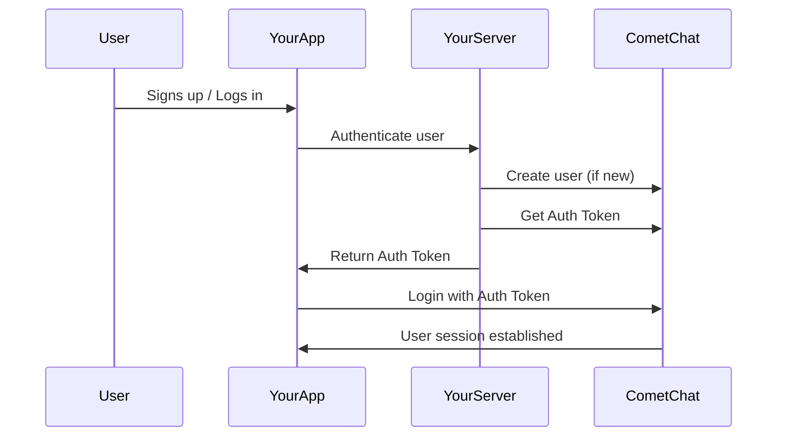

{/* Agent-Friendly Quick Reference */}
<Info>
**Quick Reference**

```javascript
// Development: Login with Auth Key (NOT for production)
await CometChat.login("USER_UID", "AUTH_KEY");

// Production: Login with Auth Token (generated server-side)
await CometChat.login("AUTH_TOKEN_FROM_SERVER");

// Check if already logged in
const user = await CometChat.getLoggedinUser();
if (user) console.log("Already logged in:", user.getName());

// Logout
await CometChat.logout();
```

**Decision:**
- Building/testing? → Use Auth Key with test users (`cometchat-uid-1` to `cometchat-uid-5`)
- Going to production? → Generate Auth Tokens server-side via REST API
</Info>

CometChat requires users to be authenticated before they can send or receive messages. This guide covers the authentication flow and best practices for both development and production environments.

<Note>
**CometChat does not handle user management.** You manage user registration and login in your app. Once a user logs into your app, you programmatically log them into CometChat.
</Note>

## Authentication Flow



## Choose Your Authentication Method

<CardGroup cols={2}>
  <Card title="Auth Key (Development)" icon="key">
    Simple setup for prototyping and testing. The Auth Key is used directly in client code.
    
    **Use for:** POC, development, testing
  </Card>
  <Card title="Auth Token (Production)" icon="shield-check">
    Secure authentication where tokens are generated server-side. Auth Key never exposed to clients.
    
    **Use for:** Production applications
  </Card>
</CardGroup>

---

## Create a User

Before logging in, users must exist in CometChat.

<Tabs>
  <Tab title="Dashboard (Testing)">
    For testing, create users manually in the [CometChat Dashboard](https://app.cometchat.com) under **Users**.
    
    <Note>
    We provide 5 test users: `cometchat-uid-1` through `cometchat-uid-5`
    </Note>
  </Tab>
  <Tab title="REST API (Production)">
    For production, create users via the [Create User API](https://api-explorer.cometchat.com/reference/creates-user) when users sign up in your app.
  </Tab>
  <Tab title="SDK (On-the-fly)">
    Create users directly from the client (development only):
    
    ```javascript
    const authKey = "YOUR_AUTH_KEY";
    const uid = "user1";
    const name = "Kevin";

    const user = new CometChat.User(uid);
    user.setName(name);

    CometChat.createUser(user, authKey).then(
      (user) => console.log("User created:", user),
      (error) => console.log("Error:", error)
    );
    ```
  </Tab>
</Tabs>

<Warning>
**UID Requirements:** Alphanumeric characters, underscores, and hyphens only. No spaces, punctuation, or special characters.
</Warning>

---

## Login with Auth Key

<Warning>
**Development Only:** Auth Key login exposes your key in client code. Use [Auth Token](#login-with-auth-token) for production.
</Warning>

The simplest way to authenticate during development:

<Tabs>
  <Tab title="JavaScript">
    ```javascript
    const UID = "cometchat-uid-1";
    const authKey = "YOUR_AUTH_KEY";

    // Check if already logged in
    CometChat.getLoggedinUser().then(
      (user) => {
        if (!user) {
          // Not logged in, proceed with login
          CometChat.login(UID, authKey).then(
            (user) => {
              console.log("Login successful:", user);
            },
            (error) => {
              console.log("Login failed:", error);
            }
          );
        } else {
          console.log("Already logged in:", user);
        }
      },
      (error) => {
        console.log("Error:", error);
      }
    );
    ```
  </Tab>
  <Tab title="TypeScript">
    ```typescript
    const UID: string = "cometchat-uid-1";
    const authKey: string = "YOUR_AUTH_KEY";

    CometChat.getLoggedinUser().then(
      (user: CometChat.User | null) => {
        if (!user) {
          CometChat.login(UID, authKey).then(
            (user: CometChat.User) => {
              console.log("Login successful:", user);
            },
            (error: CometChat.CometChatException) => {
              console.log("Login failed:", error);
            }
          );
        } else {
          console.log("Already logged in:", user);
        }
      },
      (error: CometChat.CometChatException) => {
        console.log("Error:", error);
      }
    );
    ```
  </Tab>
  <Tab title="Async/Await">
    ```javascript
    const UID = "cometchat-uid-1";
    const authKey = "YOUR_AUTH_KEY";

    async function loginWithAuthKey() {
      try {
        // Check if already logged in
        let user = await CometChat.getLoggedinUser();
        
        if (user) {
          console.log("Already logged in:", user.getName());
          return user;
        }

        // Login
        user = await CometChat.login(UID, authKey);
        console.log("Login successful:", user.getName());
        return user;
      } catch (error) {
        console.error("Login failed:", error);
        throw error;
      }
    }

    loginWithAuthKey();
    ```
  </Tab>
</Tabs>

| Parameter | Description |
|-----------|-------------|
| `UID` | The unique identifier of the user to log in |
| `authKey` | Your CometChat Auth Key from the dashboard |

---

## Login with Auth Token

<Check>
**Recommended for Production:** Auth Tokens are generated server-side, keeping your Auth Key secure.
</Check>

### How It Works

<Steps>
  <Step title="User signs up in your app">
    Create the user in CometChat via [REST API](https://api-explorer.cometchat.com/reference/creates-user)
  </Step>
  <Step title="Generate Auth Token">
    Call the [Create Auth Token API](https://api-explorer.cometchat.com/reference/create-authtoken) from your server
  </Step>
  <Step title="Send token to client">
    Your server returns the Auth Token to your client app
  </Step>
  <Step title="Login with token">
    Use the token to log in via the SDK
  </Step>
</Steps>

### Client-Side Login

<Tabs>
  <Tab title="JavaScript">
    ```javascript
    const authToken = "AUTH_TOKEN_FROM_YOUR_SERVER";

    CometChat.getLoggedinUser().then(
      (user) => {
        if (!user) {
          CometChat.login(authToken).then(
            (user) => {
              console.log("Login successful:", user);
            },
            (error) => {
              console.log("Login failed:", error);
            }
          );
        } else {
          console.log("Already logged in:", user);
        }
      },
      (error) => {
        console.log("Error:", error);
      }
    );
    ```
  </Tab>
  <Tab title="TypeScript">
    ```typescript
    const authToken: string = "AUTH_TOKEN_FROM_YOUR_SERVER";

    CometChat.getLoggedinUser().then(
      (user: CometChat.User | null) => {
        if (!user) {
          CometChat.login(authToken).then(
            (user: CometChat.User) => {
              console.log("Login successful:", user);
            },
            (error: CometChat.CometChatException) => {
              console.log("Login failed:", error);
            }
          );
        } else {
          console.log("Already logged in:", user);
        }
      },
      (error: CometChat.CometChatException) => {
        console.log("Error:", error);
      }
    );
    ```
  </Tab>
  <Tab title="Async/Await">
    ```javascript
    async function loginWithAuthToken(authToken) {
      try {
        // Check if already logged in
        let user = await CometChat.getLoggedinUser();
        
        if (user) {
          console.log("Already logged in:", user.getName());
          return user;
        }

        // Login with token
        user = await CometChat.login(authToken);
        console.log("Login successful:", user.getName());
        return user;
      } catch (error) {
        console.error("Login failed:", error);
        throw error;
      }
    }

    // Get token from your server and login
    async function authenticateUser(userId) {
      // 1. Get auth token from your backend
      const response = await fetch(`/api/cometchat/token/${userId}`);
      const { authToken } = await response.json();
      
      // 2. Login to CometChat
      return loginWithAuthToken(authToken);
    }
    ```
  </Tab>
</Tabs>

| Parameter | Description |
|-----------|-------------|
| `authToken` | The Auth Token generated by your server |

---

## Check Login Status

The SDK maintains the user session. Check if a user is already logged in before calling `login()`:

<Tabs>
<Tab title="JavaScript">
```javascript
CometChat.getLoggedinUser().then(
  (user) => {
    if (user) {
      console.log("User is logged in:", user.getName());
    } else {
      console.log("No user logged in");
      // Proceed with login
    }
  },
  (error) => {
    console.log("Error checking login status:", error);
  }
);
```
</Tab>
<Tab title="Async/Await">
```javascript
async function checkLoginStatus() {
  try {
    const user = await CometChat.getLoggedinUser();
    if (user) {
      console.log("User is logged in:", user.getName());
      return user;
    } else {
      console.log("No user logged in");
      return null;
    }
  } catch (error) {
    console.log("Error checking login status:", error);
    throw error;
  }
}
```
</Tab>
</Tabs>

<Info>
You only need to call `login()` once. The SDK persists the session, so users remain logged in across page refreshes until you call `logout()`.
</Info>

---

## Logout

Log out the user when they sign out of your app:

<Tabs>
  <Tab title="JavaScript">
    ```javascript
    CometChat.logout().then(
      () => {
        console.log("Logout successful");
      },
      (error) => {
        console.log("Logout failed:", error);
      }
    );
    ```
  </Tab>
  <Tab title="TypeScript">
    ```typescript
    CometChat.logout().then(
      () => {
        console.log("Logout successful");
      },
      (error: CometChat.CometChatException) => {
        console.log("Logout failed:", error);
      }
    );
    ```
  </Tab>
  <Tab title="Async/Await">
    ```javascript
    async function logout() {
      try {
        await CometChat.logout();
        console.log("Logout successful");
        // Redirect to login page or update UI
      } catch (error) {
        console.error("Logout failed:", error);
      }
    }
    ```
  </Tab>
</Tabs>

<Warning>
Always call `CometChat.logout()` when users sign out of your app. This clears the local session and stops real-time event delivery.
</Warning>

---

## Server-Side Token Generation

Here's how to generate Auth Tokens on your backend:

<Tabs>
  <Tab title="Node.js">
    ```javascript
    // server.js
    const express = require("express");
    const fetch = require("node-fetch");

    const app = express();

    const APP_ID = process.env.COMETCHAT_APP_ID;
    const REGION = process.env.COMETCHAT_REGION;
    const API_KEY = process.env.COMETCHAT_API_KEY; // REST API Key

    // Generate auth token for a user
    app.post("/api/cometchat/token/:uid", async (req, res) => {
      const { uid } = req.params;

      try {
        const response = await fetch(
          `https://${APP_ID}.api-${REGION}.cometchat.io/v3/users/${uid}/auth_tokens`,
          {
            method: "POST",
            headers: {
              "Content-Type": "application/json",
              "apiKey": API_KEY
            }
          }
        );

        const data = await response.json();
        
        if (data.data?.authToken) {
          res.json({ authToken: data.data.authToken });
        } else {
          res.status(400).json({ error: "Failed to generate token" });
        }
      } catch (error) {
        res.status(500).json({ error: error.message });
      }
    });

    // Create user and generate token
    app.post("/api/cometchat/users", async (req, res) => {
      const { uid, name, avatar } = req.body;

      try {
        // Create user
        await fetch(
          `https://${APP_ID}.api-${REGION}.cometchat.io/v3/users`,
          {
            method: "POST",
            headers: {
              "Content-Type": "application/json",
              "apiKey": API_KEY
            },
            body: JSON.stringify({ uid, name, avatar })
          }
        );

        // Generate token
        const tokenResponse = await fetch(
          `https://${APP_ID}.api-${REGION}.cometchat.io/v3/users/${uid}/auth_tokens`,
          {
            method: "POST",
            headers: {
              "Content-Type": "application/json",
              "apiKey": API_KEY
            }
          }
        );

        const tokenData = await tokenResponse.json();
        res.json({ authToken: tokenData.data.authToken });
      } catch (error) {
        res.status(500).json({ error: error.message });
      }
    });

    app.listen(3000);
    ```
  </Tab>
  <Tab title="Python">
    ```python
    # server.py
    from flask import Flask, jsonify, request
    import requests
    import os

    app = Flask(__name__)

    APP_ID = os.environ.get("COMETCHAT_APP_ID")
    REGION = os.environ.get("COMETCHAT_REGION")
    API_KEY = os.environ.get("COMETCHAT_API_KEY")

    BASE_URL = f"https://{APP_ID}.api-{REGION}.cometchat.io/v3"

    @app.route("/api/cometchat/token/<uid>", methods=["POST"])
    def generate_token(uid):
        response = requests.post(
            f"{BASE_URL}/users/{uid}/auth_tokens",
            headers={
                "Content-Type": "application/json",
                "apiKey": API_KEY
            }
        )
        
        data = response.json()
        if "data" in data and "authToken" in data["data"]:
            return jsonify({"authToken": data["data"]["authToken"]})
        return jsonify({"error": "Failed to generate token"}), 400

    if __name__ == "__main__":
        app.run(port=3000)
    ```
  </Tab>
</Tabs>

---

## User Object

On successful login, you receive a `User` object with the following properties:

| Property | Type | Description |
|----------|------|-------------|
| `uid` | string | Unique identifier |
| `name` | string | Display name |
| `avatar` | string | Profile picture URL |
| `status` | string | `online` or `offline` |
| `role` | string | User role for access control |
| `metadata` | object | Custom data |
| `lastActiveAt` | number | Unix timestamp of last activity |

Access user properties:

<Tabs>
<Tab title="JavaScript">
```javascript
CometChat.login(UID, authKey).then((user) => {
  console.log("UID:", user.getUid());
  console.log("Name:", user.getName());
  console.log("Avatar:", user.getAvatar());
  console.log("Status:", user.getStatus());
});
```
</Tab>
<Tab title="Async/Await">
```javascript
async function loginAndGetUserInfo(UID, authKey) {
  try {
    const user = await CometChat.login(UID, authKey);
    console.log("UID:", user.getUid());
    console.log("Name:", user.getName());
    console.log("Avatar:", user.getAvatar());
    console.log("Status:", user.getStatus());
    return user;
  } catch (error) {
    console.log("Login failed:", error);
    throw error;
  }
}
```
</Tab>
</Tabs>

---

## Listen for Login Events

Monitor authentication state changes across devices:

```javascript
const listenerID = "AUTH_LISTENER";

CometChat.addLoginListener(
  listenerID,
  new CometChat.LoginListener({
    loginSuccess: (user) => {
      console.log("User logged in:", user);
    },
    logoutSuccess: () => {
      console.log("User logged out");
    },
  })
);

// Remove listener when no longer needed
CometChat.removeLoginListener(listenerID);
```

Learn more about [Login Listeners](/sdk/javascript/login-listener).

---

## Best Practices

<AccordionGroup>
  <Accordion title="Always check login status first">
    Before calling `login()`, use `getLoggedinUser()` to check if a session exists. This prevents unnecessary API calls and potential errors.
  </Accordion>
  <Accordion title="Use Auth Tokens in production">
    Never expose your Auth Key in production client code. Generate Auth Tokens server-side and pass them to your client.
  </Accordion>
  <Accordion title="Handle token expiration">
    Auth Tokens can expire. Implement token refresh logic in your app to generate new tokens when needed.
  </Accordion>
  <Accordion title="Sync logout with your app">
    Call `CometChat.logout()` when users log out of your app to properly clean up the CometChat session.
  </Accordion>
</AccordionGroup>

---

## Troubleshooting

<AccordionGroup>
  <Accordion title="'User does not exist' error">
    The UID you're trying to login with hasn't been created in CometChat.
    
    **Solutions:**
    - Use test users: `cometchat-uid-1` through `cometchat-uid-5`
    - Create the user first via REST API or SDK
    - Check for typos in the UID
  </Accordion>
  <Accordion title="'Auth Key is invalid' error">
    **Causes:**
    - Using REST API Key instead of Auth Key
    - Auth Key has extra spaces
    - Auth Key is from a different app
    
    **Solution:** Copy the Auth Key directly from Dashboard → API & Auth Keys
  </Accordion>
  <Accordion title="'Auth Token is invalid or expired' error">
    Auth Tokens have an expiration time (default: 15 minutes).
    
    **Solutions:**
    - Generate a new token from your server
    - Increase token expiration in Dashboard settings
    - Implement token refresh logic in your app
  </Accordion>
  <Accordion title="Login works but no messages received">
    **Causes:**
    - Message listeners not registered
    - WebSocket connection not established
    
    **Solutions:**
    - Register listeners after successful login
    - Check `autoEstablishSocketConnection(true)` in app settings
    - Add a connection listener to debug
  </Accordion>
</AccordionGroup>

---

## Next Steps

<CardGroup cols={2}>
  <Card title="Send Messages" icon="paper-plane" href="/sdk/javascript/send-message">
    Start sending text, media, and custom messages
  </Card>
  <Card title="User Management" icon="user" href="/sdk/javascript/user-management">
    Create, update, and manage users
  </Card>
  <Card title="Receive Messages" icon="inbox" href="/sdk/javascript/receive-message">
    Handle real-time and historical messages
  </Card>
  <Card title="Key Concepts" icon="book" href="/sdk/javascript/key-concepts">
    Understand users, groups, and messages
  </Card>
</CardGroup>
