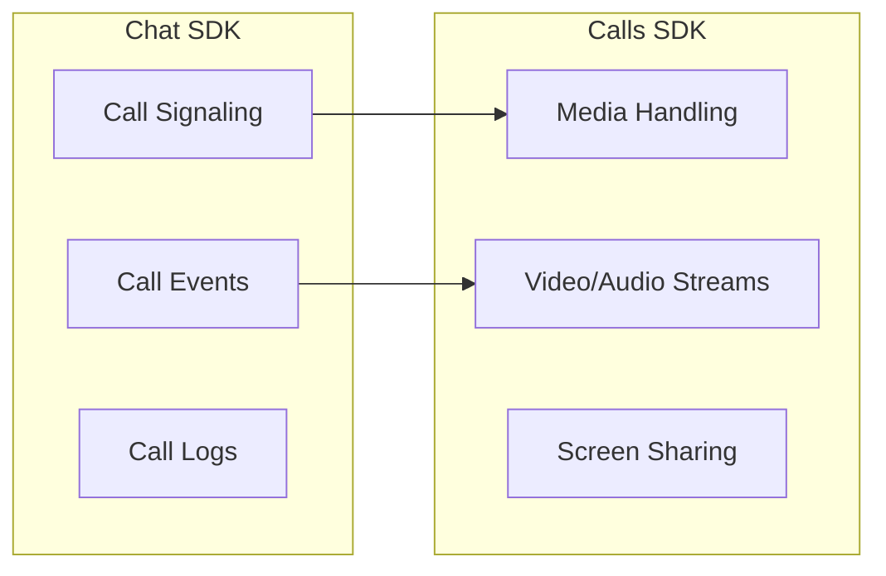

{/* TL;DR for Agents and Quick Reference */}
<Info>
**Quick Reference for AI Agents & Developers**

```javascript
// Install: npm install @cometchat/calls-sdk-javascript

// Initialize Calls SDK (after Chat SDK init)
const callSettings = new CometChatCalls.CallAppSettingsBuilder()
  .setAppId(APP_ID)
  .setRegion(REGION)
  .build();
await CometChatCalls.init(callSettings);

// Initiate a call
const call = new CometChat.Call(
  "receiver_uid",
  CometChat.CALL_TYPE.VIDEO,  // or AUDIO
  CometChat.RECEIVER_TYPE.USER  // or GROUP
);
const outgoingCall = await CometChat.initiateCall(call);

// Accept incoming call
const acceptedCall = await CometChat.acceptCall(sessionId);

// Reject/Cancel call
await CometChat.rejectCall(sessionId, CometChat.CALL_STATUS.REJECTED);

// End call
CometChatCalls.endSession();
await CometChat.endCall(sessionId);

// Listen for calls
CometChat.addCallListener("CALL_LISTENER", new CometChat.CallListener({
  onIncomingCallReceived: (call) => { /* show incoming UI */ },
  onOutgoingCallAccepted: (call) => { /* start session */ },
  onOutgoingCallRejected: (call) => { /* hide call UI */ },
  onIncomingCallCancelled: (call) => { /* hide incoming UI */ }
}));
```
</Info>

CometChat provides real-time voice and video calling capabilities for your web application. Build 1:1 calls, group calls, screen sharing, and more.

---

## How Calling Works

CometChat calling uses two SDKs working together:



| SDK | Purpose | Required |
|-----|---------|----------|
| **Chat SDK** | Call signaling (initiate, accept, reject, end) | Yes |
| **Calls SDK** | Media handling (audio, video, screen share) | Yes |

<Info>
The Chat SDK handles the "phone ringing" part, while the Calls SDK handles the actual audio/video streams.
</Info>

---

## Prerequisites

<Steps>
  <Step title="Chat SDK Installed">
    Complete the [Setup Guide](/sdk/javascript/setup-sdk) first.
  </Step>
  <Step title="Install Calls SDK">
    <Tabs>
      <Tab title="npm">
        ```bash
        npm install @cometchat/calls-sdk-javascript
        ```
      </Tab>
      <Tab title="yarn">
        ```bash
        yarn add @cometchat/calls-sdk-javascript
        ```
      </Tab>
      <Tab title="pnpm">
        ```bash
        pnpm add @cometchat/calls-sdk-javascript
        ```
      </Tab>
      <Tab title="CDN">
        ```html
        <script src="https://unpkg.com/@cometchat/calls-sdk-javascript/CometChatCalls.js"></script>
        ```
      </Tab>
    </Tabs>
  </Step>
  <Step title="Initialize Calls SDK">
    Initialize after the Chat SDK is ready:
    
    ```javascript
    import { CometChat } from "@cometchat/chat-sdk-javascript";
    import { CometChatCalls } from "@cometchat/calls-sdk-javascript";

    // After CometChat.init() succeeds
    const callAppSettings = new CometChatCalls.CallAppSettingsBuilder()
      .setAppId(APP_ID)
      .setRegion(REGION)
      .build();

    CometChatCalls.init(callAppSettings).then(
      () => console.log("Calls SDK initialized"),
      (error) => console.log("Calls SDK init failed:", error)
    );
    ```
  </Step>
</Steps>

For detailed setup, see the [Calls SDK Setup Guide](/sdk/javascript/calling-setup).

---

## Choose Your Implementation

<CardGroup cols={3}>
  <Card title="Ringing Flow" icon="phone-volume" href="/sdk/javascript/default-call">
    **Complete calling experience**
    
    Incoming/outgoing call UI, accept/reject, push notifications. Best for most apps.
  </Card>
  <Card title="Direct Call" icon="video" href="/sdk/javascript/direct-call">
    **Custom call initiation**
    
    Start calls directly without ringing. Good for scheduled calls or custom UI.
  </Card>
  <Card title="Standalone" icon="phone-flip" href="/sdk/javascript/standalone-calling">
    **Calls SDK only**
    
    No Chat SDK dependency. Use your own auth system.
  </Card>
</CardGroup>

### Which Should I Use?

| Use Case | Recommended Approach |
|----------|---------------------|
| Standard app with chat + calling | [Ringing Flow](/sdk/javascript/default-call) |
| Video conferencing / scheduled calls | [Direct Call](/sdk/javascript/direct-call) |
| Calling without chat features | [Standalone](/sdk/javascript/standalone-calling) |
| Custom call UI with own notifications | [Direct Call](/sdk/javascript/direct-call) |

---

## Quick Start: Ringing Flow

Here's a complete example of implementing voice/video calls with the ringing flow:

<Tabs>
  <Tab title="Initiate Call">
    ```javascript
    import { CometChat } from "@cometchat/chat-sdk-javascript";

    // Initiate a video call to a user
    async function startCall(receiverUID, callType = CometChat.CALL_TYPE.VIDEO) {
      const call = new CometChat.Call(
        receiverUID,
        callType,
        CometChat.RECEIVER_TYPE.USER
      );

      try {
        const outgoingCall = await CometChat.initiateCall(call);
        console.log("Call initiated:", outgoingCall);
        // Show outgoing call UI
        return outgoingCall;
      } catch (error) {
        console.error("Call initiation failed:", error);
        throw error;
      }
    }

    // Start a video call
    startCall("user123", CometChat.CALL_TYPE.VIDEO);

    // Start an audio call
    startCall("user123", CometChat.CALL_TYPE.AUDIO);
    ```
  </Tab>
  <Tab title="Receive Call">
    ```javascript
    import { CometChat } from "@cometchat/chat-sdk-javascript";

    // Listen for incoming calls
    const listenerID = "CALL_LISTENER";

    CometChat.addCallListener(
      listenerID,
      new CometChat.CallListener({
        onIncomingCallReceived: (call) => {
          console.log("Incoming call from:", call.getSender().getName());
          // Show incoming call UI with accept/reject buttons
          showIncomingCallUI(call);
        },
        onOutgoingCallAccepted: (call) => {
          console.log("Call accepted, starting session...");
          // Start the call session
          startCallSession(call);
        },
        onOutgoingCallRejected: (call) => {
          console.log("Call rejected");
          // Hide call UI
        },
        onIncomingCallCancelled: (call) => {
          console.log("Incoming call cancelled");
          // Hide incoming call UI
        },
        onCallEndedMessageReceived: (call) => {
          console.log("Call ended");
          // Clean up call UI
        }
      })
    );
    ```
  </Tab>
  <Tab title="Accept/Reject">
    ```javascript
    import { CometChat } from "@cometchat/chat-sdk-javascript";

    // Accept an incoming call
    async function acceptCall(call) {
      try {
        const acceptedCall = await CometChat.acceptCall(call.getSessionId());
        console.log("Call accepted:", acceptedCall);
        // Start the call session
        startCallSession(acceptedCall);
      } catch (error) {
        console.error("Accept failed:", error);
      }
    }

    // Reject an incoming call
    async function rejectCall(call, status = CometChat.CALL_STATUS.REJECTED) {
      try {
        await CometChat.rejectCall(call.getSessionId(), status);
        console.log("Call rejected");
      } catch (error) {
        console.error("Reject failed:", error);
      }
    }

    // Cancel an outgoing call
    async function cancelCall(call) {
      try {
        await CometChat.rejectCall(
          call.getSessionId(),
          CometChat.CALL_STATUS.CANCELLED
        );
        console.log("Call cancelled");
      } catch (error) {
        console.error("Cancel failed:", error);
      }
    }
    ```
  </Tab>
  <Tab title="Start Session">
    ```javascript
    import { CometChatCalls } from "@cometchat/calls-sdk-javascript";

    // Start the actual call session
    async function startCallSession(call) {
      // Generate call token
      const sessionId = call.getSessionId();
      const authToken = await getCallToken(sessionId); // See below

      const callSettings = new CometChatCalls.CallSettingsBuilder()
        .enableDefaultLayout(true)
        .setIsAudioOnlyCall(call.getType() === "audio")
        .setCallListener(
          new CometChatCalls.OngoingCallListener({
            onCallEnded: () => {
              console.log("Call ended");
              // Clean up UI
            },
            onCallEndButtonPressed: () => {
              console.log("End button pressed");
              endCall(sessionId);
            },
            onUserJoined: (user) => {
              console.log("User joined:", user.getName());
            },
            onUserLeft: (user) => {
              console.log("User left:", user.getName());
            },
            onError: (error) => {
              console.error("Call error:", error);
            }
          })
        )
        .build();

      // Start the call in a container element
      CometChatCalls.startSession(
        authToken,
        callSettings,
        document.getElementById("call-container")
      );
    }

    // Generate call token
    async function getCallToken(sessionId) {
      const loggedInUser = await CometChat.getLoggedinUser();
      const authToken = loggedInUser.getAuthToken();
      
      return CometChatCalls.generateToken(sessionId, authToken);
    }
    ```
  </Tab>
</Tabs>

---

## Call Types

| Type | Constant | Description |
|------|----------|-------------|
| Audio | `CometChat.CALL_TYPE.AUDIO` | Voice-only call |
| Video | `CometChat.CALL_TYPE.VIDEO` | Video call with camera |

| Receiver Type | Constant | Description |
|---------------|----------|-------------|
| User | `CometChat.RECEIVER_TYPE.USER` | 1:1 call |
| Group | `CometChat.RECEIVER_TYPE.GROUP` | Group call |

---

## Group Calls

Initiate a call to a group:

```javascript
const groupCall = new CometChat.Call(
  "group-guid",
  CometChat.CALL_TYPE.VIDEO,
  CometChat.RECEIVER_TYPE.GROUP
);

CometChat.initiateCall(groupCall).then(
  (call) => console.log("Group call initiated:", call),
  (error) => console.log("Failed:", error)
);
```

<Note>
In group calls, all online members receive the incoming call notification. The call continues as long as at least one participant remains.
</Note>

---

## Call Status Constants

| Status | Constant | Description |
|--------|----------|-------------|
| Initiated | `CometChat.CALL_STATUS.INITIATED` | Call started, waiting for response |
| Ongoing | `CometChat.CALL_STATUS.ONGOING` | Call in progress |
| Unanswered | `CometChat.CALL_STATUS.UNANSWERED` | No answer (timeout) |
| Rejected | `CometChat.CALL_STATUS.REJECTED` | Receiver rejected |
| Busy | `CometChat.CALL_STATUS.BUSY` | Receiver is on another call |
| Cancelled | `CometChat.CALL_STATUS.CANCELLED` | Caller cancelled |
| Ended | `CometChat.CALL_STATUS.ENDED` | Call ended normally |

---

## Features

<CardGroup cols={2}>
  <Card title="Screen Sharing" icon="display" href="/sdk/javascript/presenter-mode">
    Share your screen or application windows during calls.
  </Card>
  <Card title="Recording" icon="circle-dot" href="/sdk/javascript/recording">
    Record calls for playback, compliance, or training.
  </Card>
  <Card title="Virtual Background" icon="image" href="/sdk/javascript/virtual-background">
    Blur or replace backgrounds during video calls.
  </Card>
  <Card title="Video Customization" icon="sliders" href="/sdk/javascript/video-view-customisation">
    Customize video layout, tiles, and appearance.
  </Card>
  <Card title="Custom CSS" icon="paintbrush" href="/sdk/javascript/custom-css">
    Style the calling UI to match your app.
  </Card>
  <Card title="Presenter Mode" icon="presentation-screen" href="/sdk/javascript/presenter-mode">
    Spotlight the active speaker in group calls.
  </Card>
  <Card title="Call Logs" icon="list" href="/sdk/javascript/call-logs">
    Retrieve call history with duration and status.
  </Card>
  <Card title="Session Timeout" icon="clock" href="/sdk/javascript/session-timeout">
    Auto-end calls when participants are inactive.
  </Card>
</CardGroup>

---

## Call Listener Events

| Event | Description |
|-------|-------------|
| `onIncomingCallReceived` | Someone is calling you |
| `onOutgoingCallAccepted` | Your call was accepted |
| `onOutgoingCallRejected` | Your call was rejected |
| `onIncomingCallCancelled` | Caller cancelled before you answered |
| `onCallEndedMessageReceived` | Call ended |

```javascript
CometChat.addCallListener(
  "CALL_LISTENER",
  new CometChat.CallListener({
    onIncomingCallReceived: (call) => {
      // Show incoming call UI
    },
    onOutgoingCallAccepted: (call) => {
      // Start call session
    },
    onOutgoingCallRejected: (call) => {
      // Show "call rejected" message
    },
    onIncomingCallCancelled: (call) => {
      // Hide incoming call UI
    },
    onCallEndedMessageReceived: (call) => {
      // Clean up call UI
    }
  })
);
```

---

## End a Call

```javascript
import { CometChat } from "@cometchat/chat-sdk-javascript";
import { CometChatCalls } from "@cometchat/calls-sdk-javascript";

async function endCall(sessionId) {
  try {
    // End the call session
    CometChatCalls.endSession();
    
    // Notify CometChat
    await CometChat.endCall(sessionId);
    console.log("Call ended successfully");
  } catch (error) {
    console.error("End call failed:", error);
  }
}
```

---

## React Implementation Example

```jsx
import { useEffect, useState, useCallback } from "react";
import { CometChat } from "@cometchat/chat-sdk-javascript";
import { CometChatCalls } from "@cometchat/calls-sdk-javascript";

export function useCall() {
  const [incomingCall, setIncomingCall] = useState(null);
  const [activeCall, setActiveCall] = useState(null);

  useEffect(() => {
    const listenerID = "CALL_LISTENER";

    CometChat.addCallListener(
      listenerID,
      new CometChat.CallListener({
        onIncomingCallReceived: (call) => {
          setIncomingCall(call);
        },
        onOutgoingCallAccepted: (call) => {
          setActiveCall(call);
          setIncomingCall(null);
        },
        onOutgoingCallRejected: () => {
          setActiveCall(null);
        },
        onIncomingCallCancelled: () => {
          setIncomingCall(null);
        },
        onCallEndedMessageReceived: () => {
          setActiveCall(null);
          setIncomingCall(null);
        }
      })
    );

    return () => {
      CometChat.removeCallListener(listenerID);
    };
  }, []);

  const initiateCall = useCallback(async (receiverUID, callType) => {
    const call = new CometChat.Call(
      receiverUID,
      callType,
      CometChat.RECEIVER_TYPE.USER
    );
    const outgoingCall = await CometChat.initiateCall(call);
    setActiveCall(outgoingCall);
    return outgoingCall;
  }, []);

  const acceptCall = useCallback(async () => {
    if (!incomingCall) return;
    const call = await CometChat.acceptCall(incomingCall.getSessionId());
    setActiveCall(call);
    setIncomingCall(null);
    return call;
  }, [incomingCall]);

  const rejectCall = useCallback(async () => {
    if (!incomingCall) return;
    await CometChat.rejectCall(
      incomingCall.getSessionId(),
      CometChat.CALL_STATUS.REJECTED
    );
    setIncomingCall(null);
  }, [incomingCall]);

  const endCall = useCallback(async () => {
    if (!activeCall) return;
    CometChatCalls.endSession();
    await CometChat.endCall(activeCall.getSessionId());
    setActiveCall(null);
  }, [activeCall]);

  return {
    incomingCall,
    activeCall,
    initiateCall,
    acceptCall,
    rejectCall,
    endCall
  };
}
```

---

## Best Practices

<AccordionGroup>
  <Accordion title="Handle permissions">
    Request camera and microphone permissions before initiating calls. Handle permission denied gracefully.
    
    ```javascript
    async function checkPermissions() {
      try {
        await navigator.mediaDevices.getUserMedia({ audio: true, video: true });
        return true;
      } catch (error) {
        console.error("Permission denied:", error);
        return false;
      }
    }
    ```
  </Accordion>
  <Accordion title="Clean up listeners">
    Always remove call listeners when components unmount to prevent memory leaks and duplicate events.
  </Accordion>
  <Accordion title="Handle network issues">
    Implement reconnection logic and show appropriate UI when network quality degrades.
  </Accordion>
  <Accordion title="Test on multiple devices">
    Test calling on different browsers and devices. WebRTC behavior can vary.
  </Accordion>
</AccordionGroup>

---

## Troubleshooting

<AccordionGroup>
  <Accordion title="Call not connecting">
    - Verify both Chat SDK and Calls SDK are initialized
    - Check that both users are logged in
    - Ensure call listeners are registered before initiating calls
  </Accordion>
  <Accordion title="No audio/video">
    - Check browser permissions for camera/microphone
    - Verify the call type matches expected media (audio vs video)
    - Test with `navigator.mediaDevices.getUserMedia()` directly
  </Accordion>
  <Accordion title="Call ends immediately">
    - Ensure `startSession()` is called after call is accepted
    - Verify the auth token is valid
    - Check for errors in the call listener
  </Accordion>
</AccordionGroup>

---

## Next Steps

<CardGroup cols={2}>
  <Card title="Ringing Flow" icon="phone-volume" href="/sdk/javascript/default-call">
    Implement complete calling with incoming/outgoing UI
  </Card>
  <Card title="Direct Call" icon="video" href="/sdk/javascript/direct-call">
    Start calls without the ringing flow
  </Card>
  <Card title="Calls SDK Setup" icon="gear" href="/sdk/javascript/calling-setup">
    Detailed Calls SDK configuration
  </Card>
  <Card title="Recording" icon="circle-dot" href="/sdk/javascript/recording">
    Record calls for playback
  </Card>
</CardGroup>
