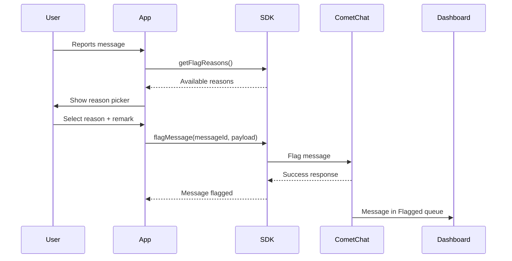

{/* TL;DR for Agents and Quick Reference */}
<Accordion title="AI Integration Quick Reference">

```javascript
// Get available flag reasons
const reasons = await CometChat.getFlagReasons();

// Flag a message
await CometChat.flagMessage("MESSAGE_ID", {
  reasonId: "spam",
  remark: "Promotional content"
});
```
</Accordion>

## Overview

Flagging messages allows users to report inappropriate content to moderators or administrators. When a message is flagged, it appears in the [CometChat Dashboard](https://app.cometchat.com) under **Moderation > Flagged Messages** for review.

<Note>
For a complete understanding of how flagged messages are reviewed and managed, see the [Flagged Messages](/moderation/flagged-messages) documentation.
</Note>

## Prerequisites

Before using the flag message feature:

1. Moderation must be enabled for your app in the [CometChat Dashboard](https://app.cometchat.com)
2. Flag reasons should be configured under **Moderation > Advanced Settings**

## How It Works



## Get Flag Reasons

Before flagging a message, retrieve the list of available flag reasons configured in your Dashboard:

<Tabs>
  <Tab title="TypeScript">
    ```typescript
    CometChat.getFlagReasons().then(
      (reasons: CometChat.FlagReason[]) => {
        console.log("Flag reasons retrieved:", reasons);
        // reasons is an array of { id, reason } objects
        // Use these to populate your report dialog UI
      },
      (error: CometChat.CometChatException) => {
        console.log("Failed to get flag reasons:", error);
      }
    );
    ```
  </Tab>
  <Tab title="JavaScript">
    ```javascript
    CometChat.getFlagReasons().then(
      (reasons) => {
        console.log("Flag reasons retrieved:", reasons);
        // reasons is an array of { id, reason } objects
        // Use these to populate your report dialog UI
      },
      (error) => {
        console.log("Failed to get flag reasons:", error);
      }
    );
    ```
  </Tab>
</Tabs>

### Response

The response is an array of flag reason objects:

```javascript
[
  { "id": "spam", "reason": "Spam or misleading" },
  { "id": "harassment", "reason": "Harassment or bullying" },
  { "id": "hate_speech", "reason": "Hate speech" },
  { "id": "violence", "reason": "Violence or dangerous content" },
  { "id": "inappropriate", "reason": "Inappropriate content" },
  { "id": "other", "reason": "Other" }
]
```

## Flag a Message

To flag a message, use the `flagMessage()` method with the message ID and a payload containing the reason:

<Tabs>
  <Tab title="TypeScript">
    ```typescript
    const messageId: string = "MESSAGE_ID_TO_FLAG";
    const payload: { reasonId: string; remark?: string } = {
      reasonId: "spam",
      remark: "This message contains promotional content"
    };

    CometChat.flagMessage(messageId, payload).then(
      (response: CometChat.FlagMessageResponse) => {
        console.log("Message flagged successfully:", response);
      },
      (error: CometChat.CometChatException) => {
        console.log("Message flagging failed:", error);
      }
    );
    ```
  </Tab>
  <Tab title="JavaScript">
    ```javascript
    const messageId = "MESSAGE_ID_TO_FLAG";
    const payload = {
      reasonId: "spam",  // Required: ID from getFlagReasons()
      remark: "This message contains promotional content"  // Optional
    };

    CometChat.flagMessage(messageId, payload).then(
      (response) => {
        console.log("Message flagged successfully:", response);
      },
      (error) => {
        console.log("Message flagging failed:", error);
      }
    );
    ```
  </Tab>
</Tabs>

### Parameters

| Parameter | Type | Required | Description |
|-----------|------|----------|-------------|
| messageId | string | Yes | The ID of the message to flag |
| payload.reasonId | string | Yes | ID of the flag reason (from `getFlagReasons()`) |
| payload.remark | string | No | Additional context or explanation from the user |

### Response

```javascript
{
  "success": true,
  "message": "Message with id {{messageId}} has been flagged successfully"
}
```

The `flagMessage()` method flags a [`BaseMessage`](/sdk/reference/messages#basemessage) object for moderation. The flagged message can be identified using getter methods:

| Field | Getter | Return Type | Description |
|-------|--------|-------------|-------------|
| id | `getId()` | `number` | Unique message ID |
| sender | `getSender()` | [`User`](/sdk/reference/entities#user) | The user who sent the message |
| type | `getType()` | `string` | Message type (`text`, `image`, `custom`, etc.) |
| sentAt | `getSentAt()` | `number` | Timestamp when the message was sent |

## Complete Example

Here's a complete implementation showing how to build a report message flow:

```javascript
class ReportMessageHandler {
  constructor() {
    this.flagReasons = [];
  }

  // Load flag reasons (call this on app init or when needed)
  async loadFlagReasons() {
    try {
      this.flagReasons = await CometChat.getFlagReasons();
      return this.flagReasons;
    } catch (error) {
      console.error("Failed to load flag reasons:", error);
      return [];
    }
  }

  // Get reasons for UI display
  getReasons() {
    return this.flagReasons;
  }

  // Flag a message with selected reason
  async flagMessage(messageId, reasonId, remark = "") {
    if (!reasonId) {
      throw new Error("Reason ID is required");
    }

    try {
      const payload = { reasonId };
      if (remark) {
        payload.remark = remark;
      }

      const response = await CometChat.flagMessage(messageId, payload);
      console.log("Message flagged successfully");
      return { success: true, response };
    } catch (error) {
      console.error("Failed to flag message:", error);
      return { success: false, error };
    }
  }
}

// Usage
const reportHandler = new ReportMessageHandler();

// Load reasons when app initializes
await reportHandler.loadFlagReasons();

// When user wants to report a message
const reasons = reportHandler.getReasons();
// Display reasons in UI for user to select...

// When user submits the report
const result = await reportHandler.flagMessage(
  "message_123",
  "spam",
  "User is sending promotional links"
);

if (result.success) {
  showToast("Message reported successfully");
}
```

---

## Next Steps

<CardGroup cols={2}>
  <Card title="AI Moderation" icon="shield-check" href="/sdk/javascript/ai-moderation">
    Automate content moderation with AI
  </Card>
  <Card title="Delete a Message" icon="trash" href="/sdk/javascript/delete-message">
    Remove messages from conversations
  </Card>
  <Card title="Receive Messages" icon="envelope-open" href="/sdk/javascript/receive-message">
    Listen for incoming messages in real time
  </Card>
  <Card title="Send Messages" icon="paper-plane" href="/sdk/javascript/send-message">
    Send text, media, and custom messages
  </Card>
</CardGroup>
