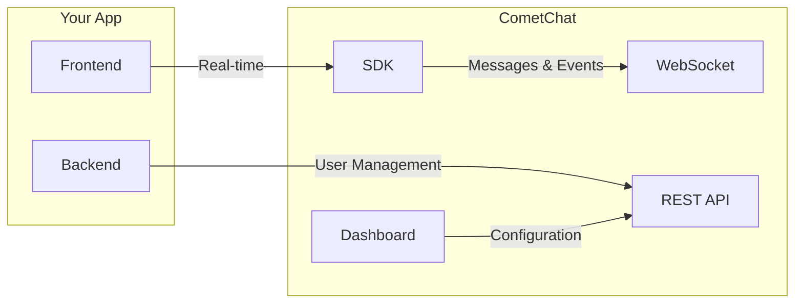
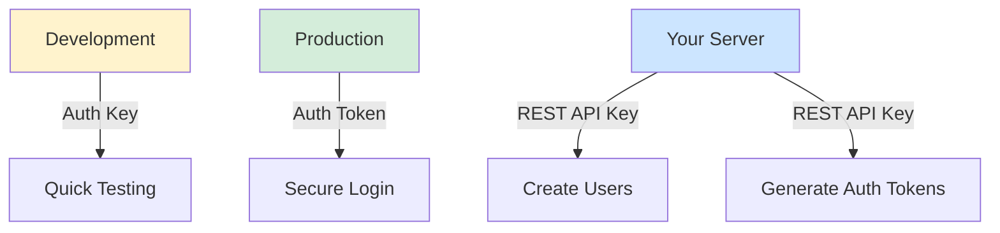
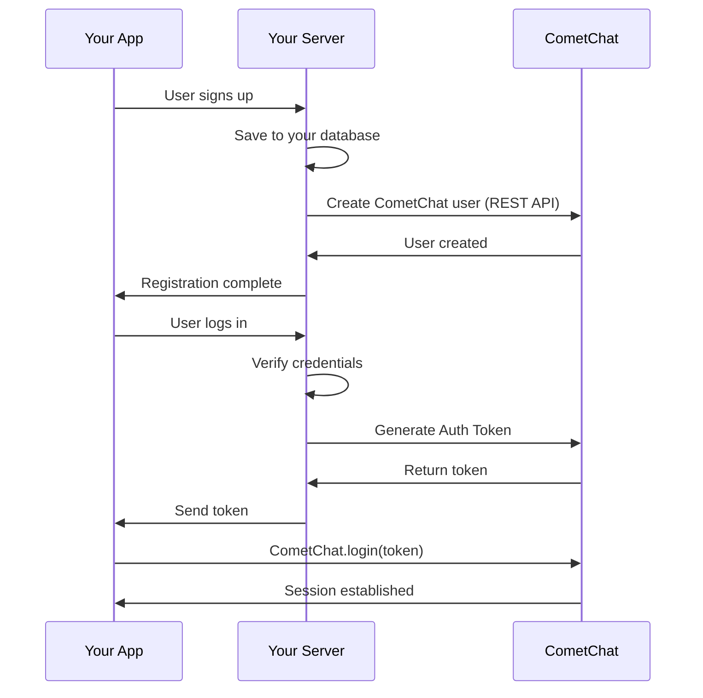
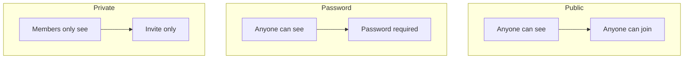
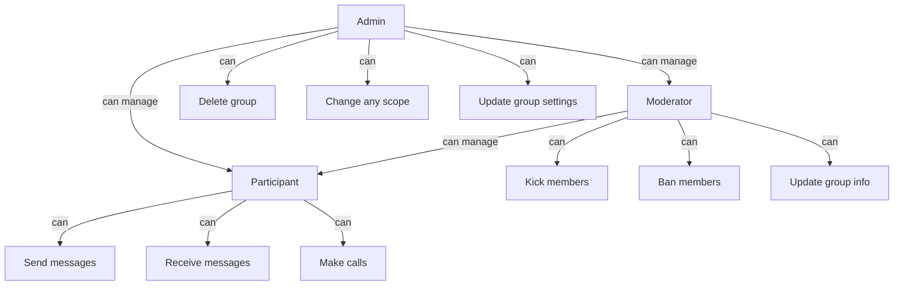
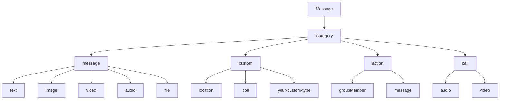
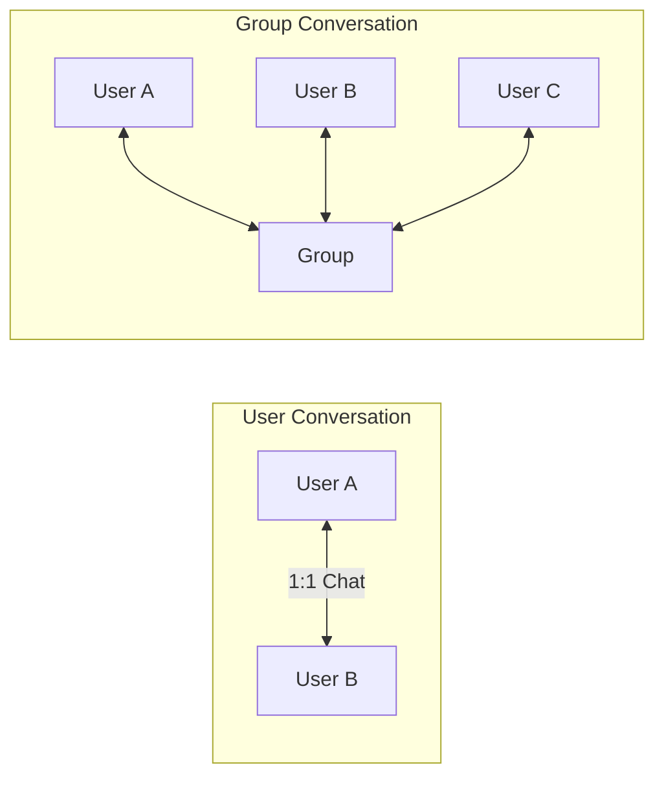
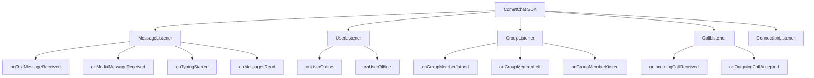
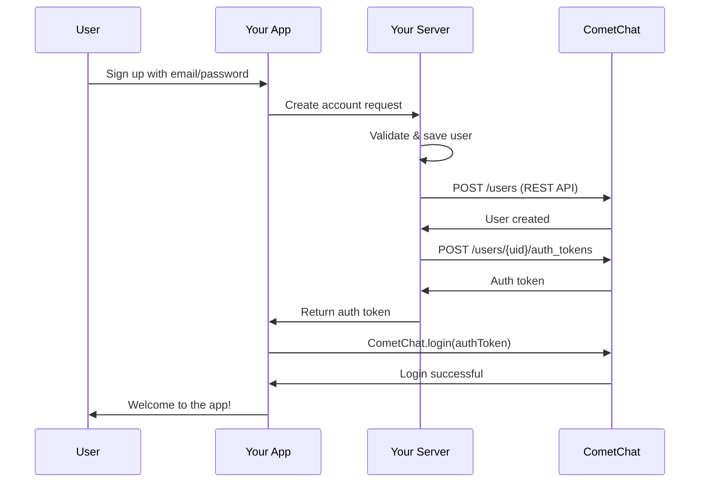
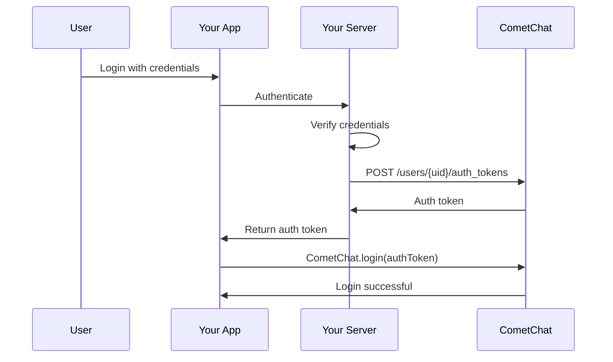

Before diving into implementation, understanding these core concepts will help you build better chat experiences. This guide covers everything you need to know about how CometChat works.

---

## How CometChat Works

CometChat provides the messaging infrastructure so you can focus on your app's unique features.



| Component | What It Does | When to Use |
|-----------|--------------|-------------|
| **SDK** | Real-time messaging from client | Sending/receiving messages, presence, typing |
| **REST API** | Server-side operations | Creating users, generating auth tokens |
| **Dashboard** | Configuration & monitoring | Setup, analytics, testing |
| **WebSocket** | Real-time event delivery | Automatic (SDK manages this) |

<Info>
**Key Principle:** CometChat handles messaging infrastructure. You handle user management and business logic in your app.
</Info>

---

## CometChat Dashboard

The [CometChat Dashboard](https://app.cometchat.com) is your control center:

<Steps>
  <Step title="Create Your App">
    Sign up and create a new app. Choose a region closest to your users.
  </Step>
  <Step title="Get Credentials">
    Navigate to **API & Auth Keys** to find your App ID, Region, and Auth Key.
  </Step>
  <Step title="Configure Features">
    Enable extensions, set up webhooks, and configure settings.
  </Step>
  <Step title="Test with Sample Users">
    Use the pre-created test users (`cometchat-uid-1` to `cometchat-uid-5`) for development.
  </Step>
  <Step title="Monitor Usage">
    Track messages, users, and API calls in the Analytics section.
  </Step>
</Steps>

<Note>
**How many apps should I create?**

Create **two apps**: one for development and one for production. Use a single app across all platforms (web, iOS, Android) so users can communicate regardless of their device.
</Note>

---

## API Keys & Security

CometChat provides different keys for different purposes:

| Key | Access Level | Where to Use | Security |
|-----|--------------|--------------|----------|
| **App ID** | Identifies your app | Client & Server | Public (safe to expose) |
| **Auth Key** | Create/login users | Client (dev only) | ⚠️ Development only |
| **REST API Key** | Full admin access | Server only | 🔒 Never expose |
| **Auth Token** | Single user session | Client | ✅ Production recommended |



<Warning>
**Security Rules:**
1. Never expose REST API Key in client code
2. Use Auth Key only during development
3. In production, generate Auth Tokens server-side
</Warning>

---

## Users

A **User** represents anyone who can send or receive messages in your app.

### User Lifecycle



### User Identifier (UID)

Each user needs a unique identifier:

| Rule | Valid | Invalid |
|------|-------|---------|
| Alphanumeric | `user123`, `john_doe` | - |
| Underscores | `user_name` | - |
| Hyphens | `user-456` | - |
| No spaces | - | `user 123` |
| No special chars | - | `john@doe`, `user.name` |
| Case-sensitive | `User1` ≠ `user1` | - |

<Info>
**Best Practice:** Use the same user ID from your database as the CometChat UID for easy mapping.
</Info>

### User Properties

```javascript
// Creating a user with all properties
const user = new CometChat.User("user123");
user.setName("John Doe");
user.setAvatar("https://example.com/avatar.png");
user.setRole("premium");
user.setMetadata({
  department: "Engineering",
  location: "New York"
});
user.setTags(["developer", "team-alpha"]);
user.setStatusMessage("Available for chat");

// Create the user (requires Auth Key)
CometChat.createUser(user, authKey);
```

| Property | Type | Description | Editable |
|----------|------|-------------|----------|
| `uid` | string | Unique identifier | Create only |
| `name` | string | Display name | ✅ |
| `avatar` | string | Profile picture URL | ✅ |
| `role` | string | Role for filtering/permissions | ✅ |
| `metadata` | object | Custom JSON data | ✅ |
| `tags` | array | Tags for categorization | ✅ |
| `statusMessage` | string | Custom status text | ✅ |
| `status` | string | `online` / `offline` | ❌ (system) |
| `lastActiveAt` | number | Last activity timestamp | ❌ (system) |

### User Roles

Roles help you segment users and control features:

```javascript
// Filter users by role
const usersRequest = new CometChat.UsersRequestBuilder()
  .setRoles(["premium", "moderator"])
  .build();

// Subscribe to presence for specific roles only
const appSettings = new CometChat.AppSettingsBuilder()
  .subscribePresenceForRoles(["premium", "vip"])
  .setRegion(region)
  .build();
```

| Example Role | Use Case |
|--------------|----------|
| `default` | Regular users |
| `premium` | Paid subscribers |
| `moderator` | Content moderators |
| `admin` | App administrators |
| `support` | Customer support agents |

---

## Groups

A **Group** enables multiple users to communicate together.

### Group Types



| Type | Visibility | Join Method | Use Case |
|------|------------|-------------|----------|
| **Public** | Everyone | Open join | Community channels, public forums |
| **Password** | Everyone | Password required | Semi-private rooms, events |
| **Private** | Members only | Invitation (auto-join) | Team chats, support tickets |

```javascript
// Create different group types
const publicGroup = new CometChat.Group(
  "community",
  "Community Chat",
  CometChat.GROUP_TYPE.PUBLIC
);

const passwordGroup = new CometChat.Group(
  "event-123",
  "VIP Event",
  CometChat.GROUP_TYPE.PASSWORD,
  "secretPassword"
);

const privateGroup = new CometChat.Group(
  "team-alpha",
  "Team Alpha",
  CometChat.GROUP_TYPE.PRIVATE
);
```

### Member Scopes (Permissions)



| Scope | Assigned To | Capabilities |
|-------|-------------|--------------|
| **Admin** | Group creator (default) | Full control: delete group, manage all members, change settings |
| **Moderator** | Promoted by admin | Moderate: kick/ban participants, update group info |
| **Participant** | All other members | Basic: send/receive messages, join calls |

```javascript
// Add member with specific scope
const member = new CometChat.GroupMember(
  "user123",
  CometChat.GROUP_MEMBER_SCOPE.MODERATOR
);

// Change member scope
CometChat.updateGroupMemberScope(
  "group-guid",
  "user123",
  CometChat.GROUP_MEMBER_SCOPE.ADMIN
);
```

### Group Properties

```javascript
// Create group with all properties
const group = new CometChat.Group(
  "team-123",           // GUID
  "Engineering Team",   // Name
  CometChat.GROUP_TYPE.PRIVATE
);

group.setIcon("https://example.com/group-icon.png");
group.setDescription("Engineering team discussions");
group.setMetadata({ department: "Engineering", project: "Alpha" });
group.setTags(["engineering", "internal"]);

CometChat.createGroup(group);
```

---

## Messages

Messages are the core of chat functionality. CometChat supports multiple message types and categories.

### Message Categories & Types



| Category | Description | Examples |
|----------|-------------|----------|
| `message` | Standard messages | Text, images, videos, files |
| `custom` | Your custom types | Location, polls, payments |
| `action` | System events | Member joined, message deleted |
| `call` | Call events | Call initiated, ended |

### Sending Different Message Types

<Tabs>
  <Tab title="Text Message">
    ```javascript
    const textMessage = new CometChat.TextMessage(
      "receiver-uid",           // Receiver UID or GUID
      "Hello, how are you?",    // Message text
      CometChat.RECEIVER_TYPE.USER  // USER or GROUP
    );

    // Optional: Add metadata
    textMessage.setMetadata({ priority: "high" });

    // Optional: Add tags
    textMessage.setTags(["important"]);

    CometChat.sendMessage(textMessage).then(
      (message) => console.log("Sent:", message),
      (error) => console.log("Error:", error)
    );
    ```
  </Tab>
  <Tab title="Media Message">
    ```javascript
    // From file input
    const file = document.getElementById("fileInput").files[0];

    const mediaMessage = new CometChat.MediaMessage(
      "receiver-uid",
      file,
      CometChat.MESSAGE_TYPE.IMAGE,  // IMAGE, VIDEO, AUDIO, FILE
      CometChat.RECEIVER_TYPE.USER
    );

    // Optional: Add caption
    mediaMessage.setCaption("Check out this photo!");

    CometChat.sendMediaMessage(mediaMessage).then(
      (message) => console.log("Sent:", message),
      (error) => console.log("Error:", error)
    );
    ```
  </Tab>
  <Tab title="Custom Message">
    ```javascript
    // Example: Location message
    const customMessage = new CometChat.CustomMessage(
      "receiver-uid",
      CometChat.RECEIVER_TYPE.USER,
      "location",  // Your custom type
      {
        latitude: 37.7749,
        longitude: -122.4194,
        address: "San Francisco, CA"
      }
    );

    CometChat.sendCustomMessage(customMessage).then(
      (message) => console.log("Sent:", message),
      (error) => console.log("Error:", error)
    );
    ```
  </Tab>
  <Tab title="Async/Await">
    ```javascript
    // Text message
    async function sendTextMessage(receiverID, text, isGroup = false) {
      const receiverType = isGroup 
        ? CometChat.RECEIVER_TYPE.GROUP 
        : CometChat.RECEIVER_TYPE.USER;
      
      const textMessage = new CometChat.TextMessage(
        receiverID,
        text,
        receiverType
      );

      try {
        const message = await CometChat.sendMessage(textMessage);
        console.log("Sent:", message);
        return message;
      } catch (error) {
        console.error("Error:", error);
        throw error;
      }
    }

    // Media message
    async function sendMediaMessage(receiverID, file, type, isGroup = false) {
      const receiverType = isGroup 
        ? CometChat.RECEIVER_TYPE.GROUP 
        : CometChat.RECEIVER_TYPE.USER;
      
      const mediaMessage = new CometChat.MediaMessage(
        receiverID,
        file,
        type,
        receiverType
      );

      try {
        const message = await CometChat.sendMediaMessage(mediaMessage);
        console.log("Sent:", message);
        return message;
      } catch (error) {
        console.error("Error:", error);
        throw error;
      }
    }

    // Custom message
    async function sendCustomMessage(receiverID, customType, data, isGroup = false) {
      const receiverType = isGroup 
        ? CometChat.RECEIVER_TYPE.GROUP 
        : CometChat.RECEIVER_TYPE.USER;
      
      const customMessage = new CometChat.CustomMessage(
        receiverID,
        receiverType,
        customType,
        data
      );

      try {
        const message = await CometChat.sendCustomMessage(customMessage);
        console.log("Sent:", message);
        return message;
      } catch (error) {
        console.error("Error:", error);
        throw error;
      }
    }

    // Usage
    await sendTextMessage("user123", "Hello!");
    await sendMediaMessage("user123", file, CometChat.MESSAGE_TYPE.IMAGE);
    await sendCustomMessage("user123", "location", { latitude: 37.7749, longitude: -122.4194 });
    ```
  </Tab>
</Tabs>

### Message Properties

| Property | Method | Description |
|----------|--------|-------------|
| ID | `getId()` | Unique message identifier |
| Sender | `getSender()` | User who sent the message |
| Receiver | `getReceiver()` | User or Group receiving |
| Type | `getType()` | text, image, video, etc. |
| Category | `getCategory()` | message, custom, action, call |
| Sent At | `getSentAt()` | Timestamp when sent |
| Delivered At | `getDeliveredAt()` | When delivered |
| Read At | `getReadAt()` | When read |
| Edited At | `getEditedAt()` | When edited (if edited) |
| Deleted At | `getDeletedAt()` | When deleted (if deleted) |
| Metadata | `getMetadata()` | Custom data attached |
| Tags | `getTags()` | Tags for filtering |

---

## Conversations

A **Conversation** represents a chat thread and is automatically created when messages are exchanged.

### Conversation Types



| Type | Description | Created When |
|------|-------------|--------------|
| **User** | One-on-one chat | First message between two users |
| **Group** | Group chat | User joins or messages a group |

### Conversation Properties

<Tabs>
<Tab title="JavaScript">
```javascript
// Fetch conversations
const conversationsRequest = new CometChat.ConversationsRequestBuilder()
  .setLimit(30)
  .build();

conversationsRequest.fetchNext().then((conversations) => {
  conversations.forEach((conversation) => {
    // Conversation details
    console.log("ID:", conversation.getConversationId());
    console.log("Type:", conversation.getConversationType()); // "user" or "group"
    console.log("Unread:", conversation.getUnreadMessageCount());
    console.log("Updated:", conversation.getUpdatedAt());
    
    // Last message
    const lastMessage = conversation.getLastMessage();
    console.log("Last message:", lastMessage?.getText());
    
    // Conversation partner (user or group)
    const partner = conversation.getConversationWith();
    console.log("With:", partner.getName());
  });
});
```
</Tab>
<Tab title="Async/Await">
```javascript
async function fetchConversations() {
  const conversationsRequest = new CometChat.ConversationsRequestBuilder()
    .setLimit(30)
    .build();

  try {
    const conversations = await conversationsRequest.fetchNext();
    
    conversations.forEach((conversation) => {
      console.log("ID:", conversation.getConversationId());
      console.log("Type:", conversation.getConversationType());
      console.log("Unread:", conversation.getUnreadMessageCount());
      console.log("Updated:", conversation.getUpdatedAt());
      
      const lastMessage = conversation.getLastMessage();
      console.log("Last message:", lastMessage?.getText());
      
      const partner = conversation.getConversationWith();
      console.log("With:", partner.getName());
    });
    
    return conversations;
  } catch (error) {
    console.log("Error:", error);
    throw error;
  }
}
```
</Tab>
</Tabs>

| Property | Method | Description |
|----------|--------|-------------|
| ID | `getConversationId()` | Unique conversation ID |
| Type | `getConversationType()` | `user` or `group` |
| Last Message | `getLastMessage()` | Most recent message |
| Unread Count | `getUnreadMessageCount()` | Number of unread messages |
| Updated At | `getUpdatedAt()` | Last activity timestamp |
| Conversation With | `getConversationWith()` | User or Group object |
| Tags | `getTags()` | Conversation tags |

### Building a Chat List

```javascript
// Typical "Recent Chats" implementation
async function loadRecentChats() {
  const request = new CometChat.ConversationsRequestBuilder()
    .setLimit(30)
    .build();

  const conversations = await request.fetchNext();
  
  return conversations.map((conv) => ({
    id: conv.getConversationId(),
    name: conv.getConversationWith().getName(),
    avatar: conv.getConversationWith().getAvatar(),
    lastMessage: conv.getLastMessage()?.getText() || "No messages",
    unreadCount: conv.getUnreadMessageCount(),
    timestamp: conv.getUpdatedAt(),
    isGroup: conv.getConversationType() === "group"
  }));
}
```

---

## Real-Time Events

CometChat uses WebSocket connections to deliver events instantly. You register **listeners** to handle these events.

### Available Listeners



| Listener | Events | Use Case |
|----------|--------|----------|
| **MessageListener** | Messages, typing, receipts, reactions | Chat UI updates |
| **UserListener** | Online/offline status | Presence indicators |
| **GroupListener** | Member changes, scope changes | Group roster updates |
| **CallListener** | Incoming/outgoing calls | Call handling |
| **ConnectionListener** | Connected/disconnected | Network status UI |

### Registering Listeners

<Tabs>
  <Tab title="Message Listener">
    ```javascript
    const listenerID = "UNIQUE_MESSAGE_LISTENER";

    CometChat.addMessageListener(
      listenerID,
      new CometChat.MessageListener({
        onTextMessageReceived: (message) => {
          console.log("Text received:", message.getText());
          // Update your chat UI
        },
        onMediaMessageReceived: (message) => {
          console.log("Media received:", message.getAttachment());
        },
        onTypingStarted: (typingIndicator) => {
          console.log(typingIndicator.getSender().getName(), "is typing...");
        },
        onTypingEnded: (typingIndicator) => {
          console.log(typingIndicator.getSender().getName(), "stopped typing");
        },
        onMessagesDelivered: (receipt) => {
          console.log("Message delivered:", receipt.getMessageId());
        },
        onMessagesRead: (receipt) => {
          console.log("Message read:", receipt.getMessageId());
        },
        onMessageEdited: (message) => {
          console.log("Message edited:", message.getId());
        },
        onMessageDeleted: (message) => {
          console.log("Message deleted:", message.getId());
        }
      })
    );

    // Remove when done (e.g., component unmount)
    CometChat.removeMessageListener(listenerID);
    ```
  </Tab>
  <Tab title="User Listener">
    ```javascript
    const listenerID = "UNIQUE_USER_LISTENER";

    CometChat.addUserListener(
      listenerID,
      new CometChat.UserListener({
        onUserOnline: (user) => {
          console.log(user.getName(), "is now online");
          // Update presence indicator to green
        },
        onUserOffline: (user) => {
          console.log(user.getName(), "went offline");
          console.log("Last seen:", user.getLastActiveAt());
          // Update presence indicator to gray
        }
      })
    );

    // Remove when done
    CometChat.removeUserListener(listenerID);
    ```
  </Tab>
  <Tab title="Group Listener">
    ```javascript
    const listenerID = "UNIQUE_GROUP_LISTENER";

    CometChat.addGroupListener(
      listenerID,
      new CometChat.GroupListener({
        onGroupMemberJoined: (message, joinedUser, joinedGroup) => {
          console.log(joinedUser.getName(), "joined", joinedGroup.getName());
        },
        onGroupMemberLeft: (message, leftUser, leftGroup) => {
          console.log(leftUser.getName(), "left", leftGroup.getName());
        },
        onGroupMemberKicked: (message, kickedUser, kickedBy, kickedFrom) => {
          console.log(kickedUser.getName(), "was kicked by", kickedBy.getName());
        },
        onGroupMemberBanned: (message, bannedUser, bannedBy, bannedFrom) => {
          console.log(bannedUser.getName(), "was banned");
        },
        onGroupMemberScopeChanged: (message, user, newScope, oldScope, group) => {
          console.log(user.getName(), "scope changed:", oldScope, "→", newScope);
        },
        onMemberAddedToGroup: (message, addedUser, addedBy, addedTo) => {
          console.log(addedUser.getName(), "was added by", addedBy.getName());
        }
      })
    );

    // Remove when done
    CometChat.removeGroupListener(listenerID);
    ```
  </Tab>
  <Tab title="Connection Listener">
    ```javascript
    const listenerID = "UNIQUE_CONNECTION_LISTENER";

    CometChat.addConnectionListener(
      listenerID,
      new CometChat.ConnectionListener({
        onConnected: () => {
          console.log("Connected to CometChat");
          // Hide offline banner, enable send button
        },
        inConnecting: () => {
          console.log("Connecting...");
          // Show "Reconnecting..." indicator
        },
        onDisconnected: () => {
          console.log("Disconnected from CometChat");
          // Show offline banner, disable send button
        }
      })
    );

    // Remove when done
    CometChat.removeConnectionListener(listenerID);
    ```
  </Tab>
</Tabs>

<Warning>
**Important Rules:**
1. Use **unique listener IDs** - duplicate IDs will overwrite previous listeners
2. **Remove listeners** when components unmount to prevent memory leaks
3. Register listeners **after login** - they won't work before authentication
</Warning>

---

## Integration Patterns

### Pattern 1: User Registration Flow



### Pattern 2: Existing User Login Flow



### Pattern 3: Chat Screen Initialization

```javascript
// Typical chat screen setup
async function initializeChatScreen(conversationId, conversationType) {
  // 1. Register message listener
  CometChat.addMessageListener(
    "CHAT_SCREEN_LISTENER",
    new CometChat.MessageListener({
      onTextMessageReceived: (message) => addMessageToUI(message),
      onMediaMessageReceived: (message) => addMessageToUI(message),
      onTypingStarted: (indicator) => showTypingIndicator(indicator),
      onTypingEnded: (indicator) => hideTypingIndicator(indicator),
      onMessagesRead: (receipt) => updateReadStatus(receipt)
    })
  );

  // 2. Fetch message history
  const messagesRequest = new CometChat.MessagesRequestBuilder()
    [conversationType === "user" ? "setUID" : "setGUID"](conversationId)
    .setLimit(30)
    .build();

  const messages = await messagesRequest.fetchPrevious();
  displayMessages(messages);

  // 3. Mark conversation as read
  if (messages.length > 0) {
    CometChat.markAsRead(messages[messages.length - 1]);
  }
}

// Cleanup when leaving chat screen
function cleanupChatScreen() {
  CometChat.removeMessageListener("CHAT_SCREEN_LISTENER");
}
```

### Integration Checklist

| Step | Your App | CometChat | When |
|------|----------|-----------|------|
| User signs up | Save to database | Create user (REST API) | Registration |
| User logs in | Verify credentials | Generate auth token → SDK login | Login |
| Open chat list | - | Fetch conversations | App load |
| Open chat | - | Fetch messages, add listeners | Enter chat |
| Send message | - | SDK handles | User action |
| Receive message | - | Listener callback | Real-time |
| User logs out | Clear session | `CometChat.logout()` | Logout |

---

## Common Patterns & Best Practices

<AccordionGroup>
  <Accordion title="Syncing Users Between Your App and CometChat">
    **When to create CometChat users:**
    - Create during user registration in your app
    - Use the same UID as your database user ID
    
    ```javascript
    // Your server-side code (Node.js example)
    async function registerUser(email, password, name) {
      // 1. Create user in your database
      const user = await db.users.create({ email, password, name });
      
      // 2. Create user in CometChat
      await fetch(`https://api-${REGION}.cometchat.io/v3/users`, {
        method: "POST",
        headers: {
          "apiKey": REST_API_KEY,
          "Content-Type": "application/json"
        },
        body: JSON.stringify({
          uid: user.id,  // Use same ID
          name: name
        })
      });
      
      return user;
    }
    ```
  </Accordion>
  
  <Accordion title="Handling Offline/Online States">
    ```javascript
    // Track connection status
    let isOnline = false;
    const pendingMessages = [];

    CometChat.addConnectionListener(
      "CONNECTION_HANDLER",
      new CometChat.ConnectionListener({
        onConnected: () => {
          isOnline = true;
          // Send any queued messages
          pendingMessages.forEach(msg => CometChat.sendMessage(msg));
          pendingMessages.length = 0;
        },
        onDisconnected: () => {
          isOnline = false;
        }
      })
    );

    // Queue messages when offline
    function sendMessage(message) {
      if (isOnline) {
        return CometChat.sendMessage(message);
      } else {
        pendingMessages.push(message);
        return Promise.resolve(message); // Optimistic UI
      }
    }
    ```
  </Accordion>
  
  <Accordion title="Efficient Listener Management">
    ```javascript
    // React example with cleanup
    useEffect(() => {
      const listenerID = `chat-${conversationId}`;
      
      CometChat.addMessageListener(
        listenerID,
        new CometChat.MessageListener({
          onTextMessageReceived: handleNewMessage
        })
      );

      // Cleanup on unmount or conversation change
      return () => {
        CometChat.removeMessageListener(listenerID);
      };
    }, [conversationId]);
    ```
  </Accordion>
  
  <Accordion title="Pagination for Large Lists">
    ```javascript
    class MessagePaginator {
      constructor(uid) {
        this.request = new CometChat.MessagesRequestBuilder()
          .setUID(uid)
          .setLimit(30)
          .build();
        this.hasMore = true;
      }

      async loadMore() {
        if (!this.hasMore) return [];
        
        const messages = await this.request.fetchPrevious();
        this.hasMore = messages.length === 30;
        return messages;
      }
    }

    // Usage
    const paginator = new MessagePaginator("user123");
    const firstPage = await paginator.loadMore();
    // On scroll up...
    const secondPage = await paginator.loadMore();
    ```
  </Accordion>
</AccordionGroup>

---

## Quick Reference

### SDK Constants

```javascript
// Receiver Types
CometChat.RECEIVER_TYPE.USER
CometChat.RECEIVER_TYPE.GROUP

// Message Types
CometChat.MESSAGE_TYPE.TEXT
CometChat.MESSAGE_TYPE.IMAGE
CometChat.MESSAGE_TYPE.VIDEO
CometChat.MESSAGE_TYPE.AUDIO
CometChat.MESSAGE_TYPE.FILE

// Group Types
CometChat.GROUP_TYPE.PUBLIC
CometChat.GROUP_TYPE.PASSWORD
CometChat.GROUP_TYPE.PRIVATE

// Member Scopes
CometChat.GROUP_MEMBER_SCOPE.ADMIN
CometChat.GROUP_MEMBER_SCOPE.MODERATOR
CometChat.GROUP_MEMBER_SCOPE.PARTICIPANT

// Call Types
CometChat.CALL_TYPE.AUDIO
CometChat.CALL_TYPE.VIDEO

// User Status
CometChat.USER_STATUS.ONLINE
CometChat.USER_STATUS.OFFLINE
```

### Common Methods Cheat Sheet

| Action | Method |
|--------|--------|
| Initialize | `CometChat.init(appID, appSettings)` |
| Login | `CometChat.login(uid, authKey)` or `CometChat.login(authToken)` |
| Logout | `CometChat.logout()` |
| Get logged-in user | `CometChat.getLoggedinUser()` |
| Send text message | `CometChat.sendMessage(textMessage)` |
| Send media | `CometChat.sendMediaMessage(mediaMessage)` |
| Fetch messages | `messagesRequest.fetchPrevious()` |
| Fetch conversations | `conversationsRequest.fetchNext()` |
| Fetch users | `usersRequest.fetchNext()` |
| Fetch groups | `groupsRequest.fetchNext()` |
| Join group | `CometChat.joinGroup(guid, type, password?)` |
| Leave group | `CometChat.leaveGroup(guid)` |
| Mark as read | `CometChat.markAsRead(message)` |
| Start typing | `CometChat.startTyping(typingIndicator)` |
| End typing | `CometChat.endTyping(typingIndicator)` |

---

## Next Steps

<CardGroup cols={2}>
  <Card title="Setup Guide" icon="gear" href="/sdk/javascript/setup-sdk">
    Install and configure the SDK for your framework
  </Card>
  <Card title="Authentication" icon="key" href="/sdk/javascript/authentication-overview">
    Learn about Auth Keys vs Auth Tokens
  </Card>
  <Card title="Send Messages" icon="paper-plane" href="/sdk/javascript/send-message">
    Send text, media, and custom messages
  </Card>
  <Card title="Receive Messages" icon="inbox" href="/sdk/javascript/receive-message">
    Handle real-time and historical messages
  </Card>
  <Card title="Users" icon="user" href="/sdk/javascript/users-overview">
    Create and manage users
  </Card>
  <Card title="Groups" icon="users" href="/sdk/javascript/groups-overview">
    Create and manage group conversations
  </Card>
</CardGroup>
