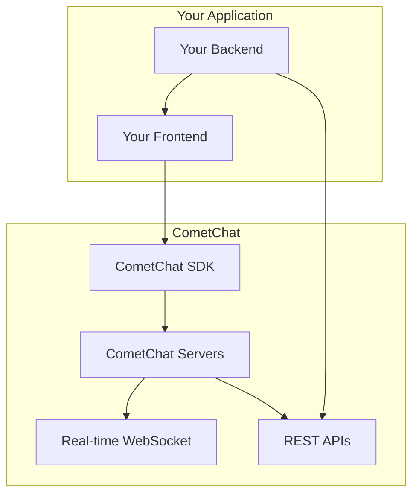
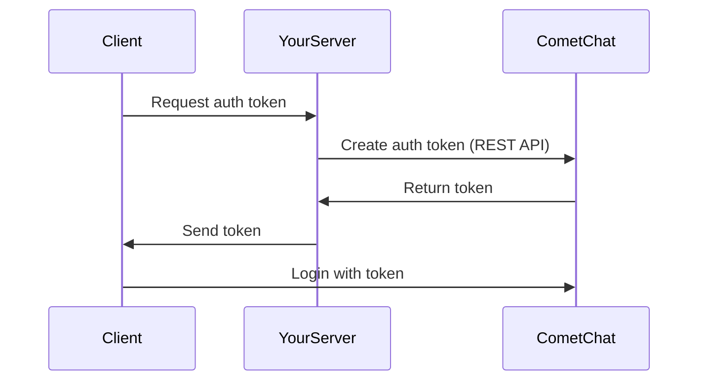

Before diving into implementation, understanding these core concepts will help you build better chat experiences.

## Architecture Overview



<Info>
**Key Principle:** CometChat handles messaging infrastructure. You handle user management and business logic in your app.
</Info>

---

## CometChat Dashboard

The [CometChat Dashboard](https://app.cometchat.com) is your control center for:

- Creating and managing apps
- Viewing API keys and credentials
- Managing users and groups
- Configuring extensions and features
- Monitoring usage and analytics

<Note>
**How many apps should I create?**

Create **two apps**: one for development and one for production. Use a single app across all platforms (web, iOS, Android) so users can communicate regardless of their device.
</Note>

---

## API Keys

CometChat provides two types of keys:

| Key Type | Privileges | Use In |
|----------|------------|--------|
| **Auth Key** | Create users, login users | Client-side (development only) |
| **REST API Key** | Full access to all CometChat operations | Server-side only |

<Warning>
**Never expose your REST API Key in client code.** It has full access to your CometChat app and should only be used server-side.
</Warning>

---

## Users

A **User** represents anyone who uses your chat feature.

### User Identifier (UID)

Each user has a unique identifier called **UID**:

- Typically matches the user's ID in your database
- Must be alphanumeric (underscores and hyphens allowed)
- No spaces or special characters
- Case-sensitive

```javascript
// Valid UIDs
"user123"
"john_doe"
"user-456"

// Invalid UIDs
"user 123"    // spaces not allowed
"john@doe"    // special characters not allowed
"user.name"   // periods not allowed
```

### User Properties

| Property | Description | Editable |
|----------|-------------|----------|
| `uid` | Unique identifier | Set at creation only |
| `name` | Display name | Yes |
| `avatar` | Profile picture URL | Yes |
| `role` | Role for access control | Yes |
| `metadata` | Custom JSON data | Yes |
| `status` | Online/offline | No (system managed) |
| `lastActiveAt` | Last activity timestamp | No (system managed) |

### User Roles

Roles help you categorize users and control access:

```javascript
// Example: Filter users by role
const usersRequest = new CometChat.UsersRequestBuilder()
  .setRoles(["premium", "moderator"])
  .build();
```

---

## Auth Tokens

Auth Tokens provide secure authentication:

- Generated server-side via REST API
- One user can have multiple tokens (one per device)
- Tokens can be revoked via dashboard or API
- More secure than using Auth Key directly



---

## Groups

A **Group** allows multiple users to communicate together.

### Group Identifier (GUID)

Each group has a unique **GUID**:

- Can match a group ID from your database
- Same naming rules as UID
- If you don't store groups, generate a random string

### Group Types

| Type | Visibility | How to Join |
|------|------------|-------------|
| **Public** | Visible to all users | Anyone can join |
| **Password** | Visible to all users | Requires correct password |
| **Private** | Only visible to members | Invitation only (auto-joined) |

```javascript
// Create different group types
CometChat.GROUP_TYPE.PUBLIC
CometChat.GROUP_TYPE.PASSWORD
CometChat.GROUP_TYPE.PRIVATE
```

### Member Scopes

Group members have different permission levels:

| Scope | Default Assignment | Capabilities |
|-------|-------------------|--------------|
| **Admin** | Group creator | Full control: manage members, update/delete group, change any member's scope |
| **Moderator** | Assigned by admin | Moderate: kick/ban participants, update group |
| **Participant** | All other members | Basic: send/receive messages and calls |

```javascript
// Member scope constants
CometChat.GROUP_MEMBER_SCOPE.ADMIN
CometChat.GROUP_MEMBER_SCOPE.MODERATOR
CometChat.GROUP_MEMBER_SCOPE.PARTICIPANT
```

---

## Messages

Messages are the core of chat functionality.

### Message Categories

| Category | Description | Types |
|----------|-------------|-------|
| **message** | Standard messages | `text`, `image`, `video`, `audio`, `file` |
| **custom** | Developer-defined messages | Any custom type you define |
| **action** | System-generated messages | `groupMember`, `message` (for actions on messages) |
| **call** | Call-related messages | `audio`, `video` |

### Message Types

<Tabs>
  <Tab title="Text">
    ```javascript
    const textMessage = new CometChat.TextMessage(
      receiverID,
      "Hello!",
      CometChat.RECEIVER_TYPE.USER
    );
    ```
  </Tab>
  <Tab title="Media">
    ```javascript
    const mediaMessage = new CometChat.MediaMessage(
      receiverID,
      file,
      CometChat.MESSAGE_TYPE.IMAGE,
      CometChat.RECEIVER_TYPE.USER
    );
    ```
  </Tab>
  <Tab title="Custom">
    ```javascript
    const customMessage = new CometChat.CustomMessage(
      receiverID,
      CometChat.RECEIVER_TYPE.USER,
      "customType",
      { key: "value" }
    );
    ```
  </Tab>
</Tabs>

### Receiver Types

Messages can be sent to users or groups:

```javascript
CometChat.RECEIVER_TYPE.USER   // One-on-one message
CometChat.RECEIVER_TYPE.GROUP  // Group message
```

Learn more in [Message Structure and Hierarchy](/sdk/javascript/message-structure-and-hierarchy).

---

## Conversations

A **Conversation** represents the chat thread between participants:

- **User conversation:** One-on-one chat between two users
- **Group conversation:** Chat within a group

Conversations track:
- Last message
- Unread message count
- Participants
- Timestamps

```javascript
// Fetch conversations
const conversationsRequest = new CometChat.ConversationsRequestBuilder()
  .setLimit(50)
  .build();

conversationsRequest.fetchNext().then(
  (conversations) => console.log("Conversations:", conversations)
);
```

---

## Real-time Events

CometChat uses WebSocket connections for real-time updates:

| Listener | Events |
|----------|--------|
| **MessageListener** | New messages, edits, deletes, reactions, typing indicators |
| **UserListener** | User online/offline status changes |
| **GroupListener** | Member joins, leaves, scope changes |
| **CallListener** | Incoming calls, call status changes |

```javascript
// Example: Listen for messages
CometChat.addMessageListener(
  "UNIQUE_LISTENER_ID",
  new CometChat.MessageListener({
    onTextMessageReceived: (message) => {
      console.log("New message:", message);
    }
  })
);
```

---

## Typical Integration Workflow

Here's how CometChat fits into your app:

| Your App Action | Your Server | CometChat |
|-----------------|-------------|-----------|
| User registers | Store user in your database | Create user via REST API |
| User logs in | Verify credentials | Generate auth token, login via SDK |
| User sends friend request | Handle in your app | No action needed |
| Friend request accepted | Update your database | Add as friends via REST API (optional) |
| User sends message | - | SDK handles automatically |
| User logs out | Clear session | Call `CometChat.logout()` |

---

## What's Next?

<CardGroup cols={2}>
  <Card title="Setup Guide" icon="gear" href="/sdk/javascript/setup-sdk">
    Install and configure the SDK
  </Card>
  <Card title="Authentication" icon="key" href="/sdk/javascript/authentication-overview">
    Learn about login methods
  </Card>
  <Card title="Send Messages" icon="paper-plane" href="/sdk/javascript/send-message">
    Start sending messages
  </Card>
  <Card title="Message Structure" icon="sitemap" href="/sdk/javascript/message-structure-and-hierarchy">
    Deep dive into message types
  </Card>
</CardGroup>
