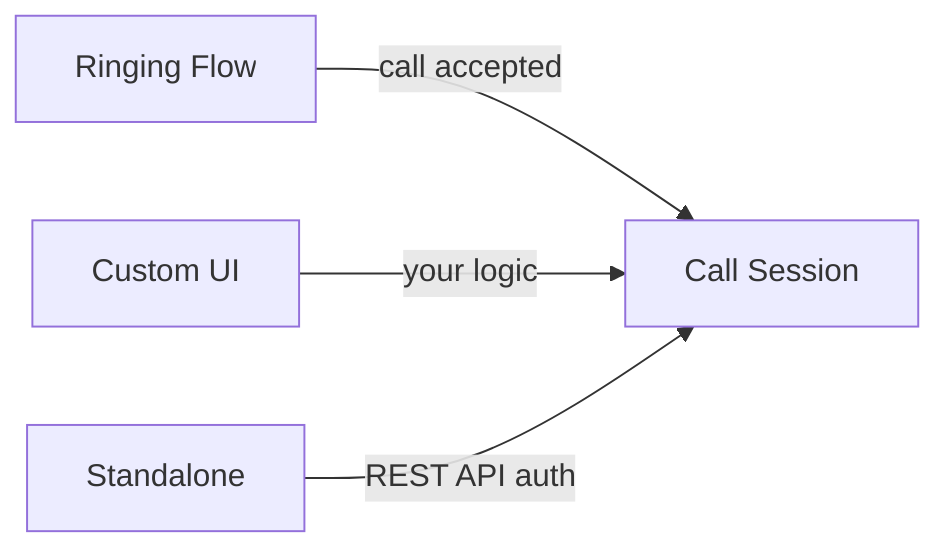

<Accordion title="AI Integration Quick Reference">

Choose your calling approach:
- **Ringing** → [Default Call](/sdk/react-native/default-call) — Full call flow with notifications, accept/reject
- **Call Session** → [Direct Call](/sdk/react-native/direct-call) — Session-based calling with custom UI
- **Standalone** → [Standalone Calling](/sdk/react-native/standalone-calling) — Calls SDK only, no Chat SDK needed

```bash
# Install Calls SDK
npm install @cometchat/calls-sdk-react-native
```

**Features:** Recording, Video View Customization, Presenter Mode, Call Logs, Session Timeout
</Accordion>

CometChat provides three ways to add voice and video calling to your React Native app. Which one you pick depends on how much of the call flow you want CometChat to handle vs. building yourself.

## Prerequisites

1. CometChat Chat SDK installed and configured. See the [Setup](/sdk/react-native/setup-sdk) guide.
2. CometChat Calls SDK added to your project:

```bash
npm install @cometchat/calls-sdk-react-native
```

For detailed setup instructions, see the [Calls SDK Setup](/sdk/react-native/calling-setup) guide.

## Choose Your Approach

### Ringing (Full Call Flow)

The complete calling experience — incoming/outgoing call UI, accept/reject/cancel, push notifications, and integration with CometChat messaging. Use this when you want CometChat to handle the entire call lifecycle.

**Flow:** Initiate call → Receiver gets notified → Accept/Reject → Start session

<Card title="Get started with Ringing" icon="phone-volume" href="/sdk/react-native/default-call">
  Implement the complete ringing call flow
</Card>

### Call Session (Session Management)

Manages the actual call session — generating tokens, starting/ending sessions, configuring the call UI, and handling in-call events. The Ringing flow uses this under the hood after a call is accepted. You can also use it directly if you want to build your own call initiation logic.

**Flow:** Generate token → Start session → Manage call → End session

<Card title="Get started with Call Session" icon="video" href="/sdk/react-native/direct-call">
  Start and manage call sessions
</Card>

### Standalone Calling (No Chat SDK)

Calling without the Chat SDK. You handle user authentication via the REST API and use only the Calls SDK. Ideal when you need voice/video but not the full chat infrastructure.

**Flow:** Get auth token via REST API → Generate call token → Start session

<Card title="Get started with Standalone Calling" icon="phone-flip" href="/sdk/react-native/standalone-calling">
  Implement calling without the Chat SDK
</Card>

### How They Relate



All three approaches converge on the Call Session layer to manage the actual media connection. The difference is how you get there — CometChat's ringing flow, your own UI, or standalone without the Chat SDK.

## Features

Once you have calling working, you can add these capabilities:

<CardGroup cols={2}>
  <Card title="Recording" icon="circle-dot" href="/sdk/react-native/recording">
    Record audio and video calls for playback, compliance, or archival purposes.
  </Card>
  <Card title="Video View Customization" icon="sliders" href="/sdk/react-native/video-view-customisation">
    Customize the video call UI layout, participant tiles, and visual appearance.
  </Card>
  <Card title="Presenter Mode" icon="presentation-screen" href="/sdk/react-native/presenter-mode">
    Enable screen sharing and presentation capabilities during calls.
  </Card>
  <Card title="Call Logs" icon="list" href="/sdk/react-native/call-logs">
    Retrieve and display call history including duration, participants, and status.
  </Card>
  <Card title="Session Timeout" icon="clock" href="/sdk/react-native/session-timeout">
    Configure automatic call termination when participants are inactive.
  </Card>
</CardGroup>

---

## Next Steps

<CardGroup cols={2}>
  <Card title="Calls SDK Setup" icon="gear" href="/sdk/react-native/calling-setup">
    Install and initialize the CometChat Calls SDK
  </Card>
  <Card title="Ringing" icon="phone-volume" href="/sdk/react-native/default-call">
    Implement the complete ringing call flow
  </Card>
  <Card title="Call Session" icon="video" href="/sdk/react-native/direct-call">
    Start and manage call sessions directly
  </Card>
  <Card title="Standalone Calling" icon="phone-flip" href="/sdk/react-native/standalone-calling">
    Use calling without the Chat SDK
  </Card>
</CardGroup>
