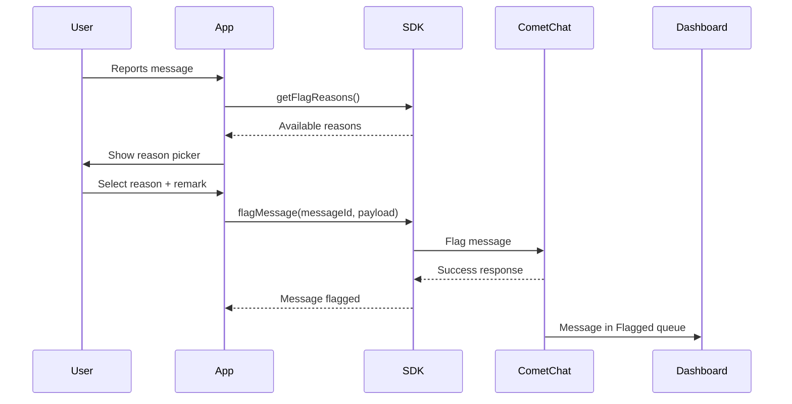

{/* TL;DR for Agents and Quick Reference */}
<Info>
**Quick Reference for AI Agents & Developers**

```javascript
// Get available flag reasons
const reasons = await CometChat.getFlagReasons();

// Flag a message with a reason
const payload = { reasonId: "spam", remark: "Promotional content" };
await CometChat.flagMessage("MESSAGE_ID", payload);
```

**Required:** Moderation enabled in [Dashboard](https://app.cometchat.com) → Moderation → Advanced Settings
</Info>

## Overview

Flagging messages allows users to report inappropriate content to moderators or administrators. When a message is flagged, it appears in the [CometChat Dashboard](https://app.cometchat.com) under **Moderation > Flagged Messages** for review.

<Note>
**Available via:** [SDK](/sdk/react-native/flag-message) | [REST API](/rest-api/moderation/flag-a-message) | [UI Kits](/ui-kit/react-native/core-features#report-message)
</Note>

<Note>
For a complete understanding of how flagged messages are reviewed and managed, see the [Flagged Messages](/moderation/flagged-messages) documentation.
</Note>

## Prerequisites

Before using the flag message feature:

1. Moderation must be enabled for your app in the [CometChat Dashboard](https://app.cometchat.com)
2. Flag reasons should be configured under **Moderation > Advanced Settings**

## How It Works



## Get Flag Reasons

Before flagging a message, retrieve the list of available flag reasons configured in your Dashboard:

<Tabs>
  <Tab title="JavaScript">
    ```javascript
    CometChat.getFlagReasons().then(
      (reasons) => {
        console.log("Flag reasons retrieved:", reasons);
        // reasons is an array of { id, reason } objects
        // Use these to populate your report dialog UI
      },
      (error) => {
        console.log("Failed to get flag reasons:", error);
      }
    );
    ```
  </Tab>
  <Tab title="TypeScript">
    ```typescript
    CometChat.getFlagReasons().then(
      (reasons: CometChat.FlagReason[]) => {
        console.log("Flag reasons retrieved:", reasons);
        // reasons is an array of { id, reason } objects
        // Use these to populate your report dialog UI
      },
      (error: CometChat.CometChatException) => {
        console.log("Failed to get flag reasons:", error);
      }
    );
    ```
  </Tab>
</Tabs>

<Accordion title="Response">
**On Success** — `getFlagReasons()` returns an array of flag reason objects:

<span id="get-flag-reasons-array" style={{scrollMarginTop: '100px'}}></span>

**Flag Reason Array (per item):**

| Parameter | Type | Description | Sample Value |
|-----------|------|-------------|--------------|
| `id` | string | Unique identifier for the flag reason | `"spam"` |
| `name` | string | Display name of the flag reason | `"Spam"` |
| `description` | string | Detailed description of the reason | `"Repeated, promotional, or irrelevant content"` |
| `createdAt` | number | Unix timestamp when reason was created | `1761627675` |
| `updatedAt` | number | Unix timestamp when reason was last updated | `1761627675` |
| `default` | boolean | Whether this is a default reason | `false` |

</Accordion>

## Flag a Message

To flag a message, use the `flagMessage()` method with the message ID and a payload containing the reason:

<Tabs>
  <Tab title="JavaScript">
    ```javascript
    const messageId = "MESSAGE_ID_TO_FLAG";
    const payload = {
      reasonId: "spam",  // Required: ID from getFlagReasons()
      remark: "This message contains promotional content"  // Optional
    };

    CometChat.flagMessage(messageId, payload).then(
      (response) => {
        console.log("Message flagged successfully:", response);
      },
      (error) => {
        console.log("Message flagging failed:", error);
      }
    );
    ```
  </Tab>
  <Tab title="TypeScript">
    ```typescript
    const messageId: string = "MESSAGE_ID_TO_FLAG";
    const payload: { reasonId: string; remark?: string } = {
      reasonId: "spam",
      remark: "This message contains promotional content"
    };

    CometChat.flagMessage(messageId, payload).then(
      (response: CometChat.FlagMessageResponse) => {
        console.log("Message flagged successfully:", response);
      },
      (error: CometChat.CometChatException) => {
        console.log("Message flagging failed:", error);
      }
    );
    ```
  </Tab>
</Tabs>

<Accordion title="Response">
**On Success** — `flagMessage()` returns a success response:

<span id="flag-message-response-object" style={{scrollMarginTop: '100px'}}></span>

**Response Object:**

| Parameter | Type | Description | Sample Value |
|-----------|------|-------------|--------------|
| `success` | boolean | Indicates if the flag operation succeeded | `true` |
| `message` | string | Confirmation message with flagged message ID | `"Message 25300 has been flagged successfully."` |

</Accordion>

### Parameters

| Parameter | Type | Required | Description |
|-----------|------|----------|-------------|
| messageId | string | Yes | The ID of the message to flag |
| payload.reasonId | string | Yes | ID of the flag reason (from `getFlagReasons()`) |
| payload.remark | string | No | Additional context or explanation from the user |

## Complete Example

Here's a complete implementation showing how to build a report message flow:

```javascript
class ReportMessageHandler {
  constructor() {
    this.flagReasons = [];
  }

  // Load flag reasons (call this on app init or when needed)
  async loadFlagReasons() {
    try {
      this.flagReasons = await CometChat.getFlagReasons();
      return this.flagReasons;
    } catch (error) {
      console.error("Failed to load flag reasons:", error);
      return [];
    }
  }

  // Get reasons for UI display
  getReasons() {
    return this.flagReasons;
  }

  // Flag a message with selected reason
  async flagMessage(messageId, reasonId, remark = "") {
    if (!reasonId) {
      throw new Error("Reason ID is required");
    }

    try {
      const payload = { reasonId };
      if (remark) {
        payload.remark = remark;
      }

      const response = await CometChat.flagMessage(messageId, payload);
      console.log("Message flagged successfully");
      return { success: true, response };
    } catch (error) {
      console.error("Failed to flag message:", error);
      return { success: false, error };
    }
  }
}

// Usage
const reportHandler = new ReportMessageHandler();

// Load reasons when app initializes
await reportHandler.loadFlagReasons();

// When user wants to report a message
const reasons = reportHandler.getReasons();
// Display reasons in UI for user to select...

// When user submits the report
const result = await reportHandler.flagMessage(
  "message_123",
  "spam",
  "User is sending promotional links"
);

if (result.success) {
  showToast("Message reported successfully");
}
```


<AccordionGroup>
  <Accordion title="Best Practices">
    - **Cache flag reasons:** Call `getFlagReasons()` once at app initialization or when the report dialog is first opened, then reuse the cached list. Avoid fetching reasons on every report action.
    - **Require a reason:** Always require users to select a reason before submitting a flag. This improves the quality of moderation data and helps moderators prioritize reviews.
    - **Provide a remark field:** Allow users to add optional context via the `remark` parameter. Additional details help moderators make faster, more informed decisions.
    - **Confirm before submitting:** Show a confirmation dialog before calling `flagMessage()` to prevent accidental reports.
    - **Show feedback after flagging:** Display a success message or toast after a message is flagged so the user knows their report was submitted.
  </Accordion>
  <Accordion title="Troubleshooting">
    - **`getFlagReasons()` returns an empty array:** Ensure that flag reasons are configured in the [CometChat Dashboard](https://app.cometchat.com) under **Moderation > Advanced Settings**. Moderation must also be enabled for your app.
    - **`flagMessage()` fails with an error:** Verify that the `reasonId` matches one of the IDs returned by `getFlagReasons()`. Also confirm that the `messageId` is valid and belongs to a conversation the logged-in user has access to.
    - **Flagged messages not appearing in Dashboard:** Check that moderation is enabled in your Dashboard settings. Flagged messages appear under **Moderation > Flagged Messages**.
    - **Permission errors:** The logged-in user must be a participant in the conversation containing the message they want to flag. Users cannot flag messages from conversations they are not part of.
  </Accordion>
</AccordionGroup>

---

## Next Steps

<CardGroup cols={2}>
  <Card title="Edit Message" icon="pen-to-square" href="/sdk/react-native/edit-message">
    Edit sent messages in one-on-one and group conversations
  </Card>
  <Card title="Delete Message" icon="trash" href="/sdk/react-native/delete-message">
    Delete messages for yourself or for all participants
  </Card>
  <Card title="Receive Messages" icon="inbox" href="/sdk/react-native/receive-messages">
    Listen for incoming messages in real time
  </Card>
  <Card title="Delivery & Read Receipts" icon="check-double" href="/sdk/react-native/delivery-read-receipts">
    Track message delivery and read status
  </Card>
</CardGroup>
