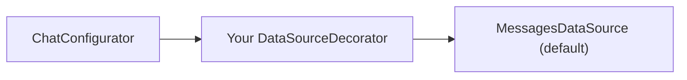

The DataSource framework is the most powerful customization mechanism in the UI Kit. It lets you globally modify how messages are rendered, what options appear on message bubbles, what attachment actions are available in the composer, and how text is formatted — all without touching individual components.

## DataSource Interface

The `DataSource` interface defines how the UI Kit provides:

- Message templates (how each message type is rendered)
- Bubble content views (the actual views inside message bubbles)
- Message options (actions on message bubbles like reply, copy, delete)
- Attachment options (composer actions like camera, gallery, file)
- AI options (AI-powered composer actions)
- Text formatters (text processing for mentions, links, etc.)

## DataSourceDecorator Pattern

`DataSourceDecorator` is an abstract class that wraps a `DataSource` and delegates all method calls to it. You extend it and override only the methods you want to customize. This is the decorator pattern — you layer behavior on top of the existing implementation.



## ChatConfigurator

`ChatConfigurator` manages the active `DataSource` instance:

| Method | Description |
|---|---|
| `ChatConfigurator.enable(Function1<DataSource, DataSource>)` | Register a decorator that wraps the current active DataSource |
| `ChatConfigurator.init()` | Reset to the default `MessagesDataSource` |

You can chain multiple decorators by calling `enable` multiple times. Each call wraps the previous DataSource.

## Example: Adding a Custom Message Option

Create a `DataSourceDecorator` that adds a "Translate" option to all text messages:


<Tabs>
<Tab title="Kotlin">
```kotlin
class TranslateDataSource(dataSource: DataSource) : DataSourceDecorator(dataSource) {

    override fun getTextMessageOptions(
        context: Context,
        baseMessage: BaseMessage,
        group: Group?,
        additionParameter: AdditionParameter
    ): List<CometChatMessageOption> {
        val options = super.getTextMessageOptions(context, baseMessage, group, additionParameter).toMutableList()
        options.add(CometChatMessageOption(
            id = "translate",
            title = "Translate",
            icon = R.drawable.ic_translate,
            onClick = { translateMessage(baseMessage) }
        ))
        return options
    }
}

// Register the decorator
ChatConfigurator.enable { dataSource -> TranslateDataSource(dataSource) }

// Reset to defaults when needed
ChatConfigurator.init()
```
</Tab>
<Tab title="Java">
```java
public class TranslateDataSource extends DataSourceDecorator {
    public TranslateDataSource(DataSource dataSource) {
        super(dataSource);
    }

    @Override
    public List<CometChatMessageOption> getTextMessageOptions(
            Context context, BaseMessage baseMessage, Group group, @NonNull AdditionParameter additionParameter) {
        List<CometChatMessageOption> options =
            new ArrayList<>(super.getTextMessageOptions(context, baseMessage, group, additionParameter));
        options.add(new CometChatMessageOption(
            "translate", "Translate", R.drawable.ic_translate,
            () -> translateMessage(baseMessage)
        ));
        return options;
    }
}

// Register the decorator
ChatConfigurator.enable(dataSource -> new TranslateDataSource(dataSource));

// Reset to defaults when needed
ChatConfigurator.init();
```
</Tab>
</Tabs>

## Message Template Methods

Message templates define how each message type is rendered. Override these to add custom message types or modify existing ones:

| Method | Description |
|---|---|
| `getTextTemplate(AdditionParameter)` | Template for text messages |
| `getImageTemplate(AdditionParameter)` | Template for image messages |
| `getVideoTemplate(AdditionParameter)` | Template for video messages |
| `getAudioTemplate(AdditionParameter)` | Template for audio messages |
| `getFileTemplate(AdditionParameter)` | Template for file messages |
| `getFormTemplate(AdditionParameter)` | Template for form messages |
| `getSchedulerTemplate(AdditionParameter)` | Template for scheduler messages |
| `getCardTemplate(AdditionParameter)` | Template for card messages |
| `getAIAssistantTemplate(AdditionParameter)` | Template for AI assistant messages |
| `getMessageTemplates(AdditionParameter)` | All message templates combined |
| `getMessageTemplate(String category, String type, AdditionParameter)` | Template for a specific category/type |

## Bubble Content View Methods

Each message type has a pair of methods following the `createView` / `bindView` pattern:

| Create Method | Bind Method | Message Type |
|---|---|---|
| `getTextBubbleContentView(...)` | `bindTextBubbleContentView(...)` | Text |
| `getImageBubbleContentView(...)` | `bindImageBubbleContentView(...)` | Image |
| `getVideoBubbleContentView(...)` | `bindVideoBubbleContentView(...)` | Video |
| `getAudioBubbleContentView(...)` | `bindAudioBubbleContentView(...)` | Audio |
| `getFileBubbleContentView(...)` | `bindFileBubbleContentView(...)` | File |
| `getFormBubbleContentView(...)` | `bindFormBubbleContentView(...)` | Form |
| `getSchedulerBubbleContentView(...)` | `bindSchedulerBubbleContentView(...)` | Scheduler |
| `getCardBubbleContentView(...)` | `bindCardBubbleContentView(...)` | Card |
| `getAIAssistantBubbleContentView(...)` | `bindAIAssistantBubbleContentView(...)` | AI Assistant |

The `get*` method creates the View (called once per ViewHolder), and the `bind*` method populates it with data (called on each bind). Override these to completely replace how a message type is rendered inside its bubble.

## Other DataSource Methods

| Method | Description |
|---|---|
| `getAttachmentOptions(Context, User, Group, HashMap, AdditionParameter)` | Composer attachment actions |
| `getAIOptions(Context, User, Group, HashMap, AIOptionsStyle, AdditionParameter)` | Composer AI actions |
| `getCommonOptions(Context, BaseMessage, Group, AdditionParameter)` | Options common to all message types |
| `getMessageOptions(Context, BaseMessage, Group, AdditionParameter)` | All options for a message |
| `getTextFormatters(Context, AdditionParameter)` | Text formatters for message processing |
| `getLastConversationMessage(Context, Conversation, AdditionParameter)` | Last message preview in conversations list |
| `getAuxiliaryHeaderMenu(Context, User, Group, AdditionParameter)` | Auxiliary header menu view |

## Related

- [Menu & Options](/ui-kit/android/customization-menu-options) — Component-level option customization.
- [Text Formatters](/ui-kit/android/customization-text-formatters) — Custom text processing via DataSource.
- [Customization Overview](/ui-kit/android/customization-overview) — See all customization categories.
