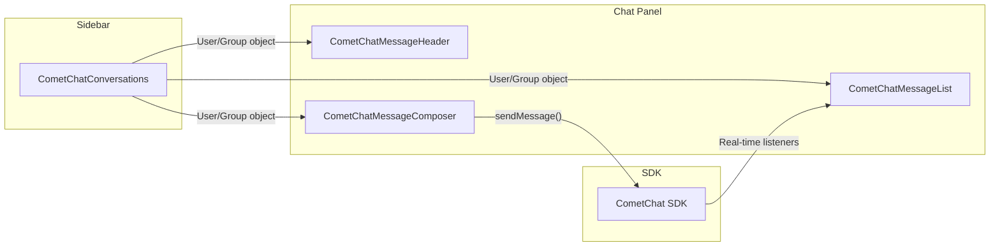
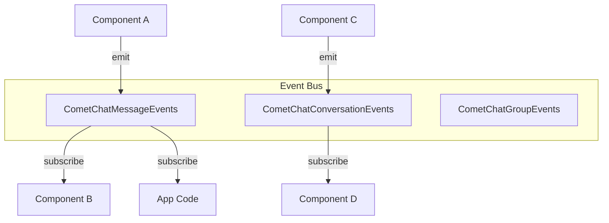

<Accordion title="AI Agent Component Spec">

| Field | Value |
| --- | --- |
| Package | `cometchat_chat_uikit` |
| Required setup | `CometChatUIKit.init()` + `CometChatUIKit.login()` before rendering any component |
| Callback actions | `on<Event>: (param) { }` |
| Data filtering | `<entity>RequestBuilder: <Entity>RequestBuilder()` |
| Toggle features | `hide<Feature>: true` or `show<Feature>: true` |
| Custom rendering | `<slot>View: (context, entity) => Widget` |
| Style overrides | `style: CometChat<Component>Style(...)` |

</Accordion>

## Architecture

The UI Kit is a set of independent widgets that compose into chat layouts. A typical two-panel layout uses four core components:

- **CometChatConversations** — sidebar listing recent conversations (users and groups)
- **CometChatMessageHeader** — toolbar showing avatar, name, online status, and typing indicator
- **CometChatMessageList** — scrollable message feed with reactions, receipts, and threads
- **CometChatMessageComposer** — rich text input with attachments, mentions, and voice notes

**Data flow**: selecting a conversation in CometChatConversations yields a `User` or `Group` object. That object is passed as a prop (`user` or `group`) to CometChatMessageHeader, CometChatMessageList, and CometChatMessageComposer. The message components use the SDK internally — CometChatMessageComposer sends messages, CometChatMessageList receives them via real-time listeners.



Components communicate through a publish/subscribe event bus (`CometChatMessageEvents`, `CometChatConversationEvents`, `CometChatGroupEvents`, etc.). A component emits events that other components or application code can subscribe to without direct references. See [Events](/ui-kit/flutter/events) for the full list.



Each component accepts callback props (`on<Event>`), view slot props (`<slot>View`) for replacing UI sections, `RequestBuilder` props for data filtering, and style class overrides via `CometChat<Component>Style`.

---

## Type of Widget

UI Widgets based on behavior and functionality can be categorized into three types: Base Widget, Widget, and Composite Widget.

### Base Widget

Base Widgets form the building blocks of your app's user interface (UI). They focus solely on presenting visual elements based on input data, without handling any business logic. These widgets provide the foundational appearance and behavior for your UI.

### Widget

Widgets build upon Base Widgets by incorporating business logic. They not only render UI elements but also manage data loading, execute specific actions, and respond to events. This combination of visual presentation and functional capabilities makes Widgets essential for creating dynamic and interactive UIs.

### Composite Widget

Composite Widgets are advanced UI elements that combine multiple Widgets or other Composite Widgets to achieve complex functionality. By layering widgets together, Composite Widgets offer a sophisticated and flexible approach to designing UIs. They enable diverse functionalities and interactions, making them versatile tools for creating rich user experiences.

---

## Component Catalog

All components are imported from `cometchat_chat_uikit`.

### Conversations and Lists

| Component | Purpose | Key Props | Page |
| --- | --- | --- | --- |
| CometChatConversations | Scrollable list of recent conversations | `conversationsRequestBuilder`, `onItemTap`, `onError` | [Conversations](/ui-kit/flutter/conversations) |
| CometChatUsers | Scrollable list of users | `usersRequestBuilder`, `onItemTap`, `onError` | [Users](/ui-kit/flutter/users) |
| CometChatGroups | Scrollable list of groups | `groupsRequestBuilder`, `onItemTap`, `onError` | [Groups](/ui-kit/flutter/groups) |
| CometChatGroupMembers | Scrollable list of group members | `group`, `groupMemberRequestBuilder`, `onItemTap` | [Group Members](/ui-kit/flutter/group-members) |

### Messages

| Component | Purpose | Key Props | Page |
| --- | --- | --- | --- |
| CometChatMessageHeader | Toolbar with avatar, name, status, typing indicator | `user`, `group`, `backButton`, `hideBackButton` | [Message Header](/ui-kit/flutter/message-header) |
| CometChatMessageList | Scrollable message list with reactions, receipts, threads | `user`, `group`, `messagesRequestBuilder`, `scrollToBottomOnNewMessages` | [Message List](/ui-kit/flutter/message-list) |
| CometChatMessageComposer | Rich text input with attachments, mentions, voice notes | `user`, `group`, `onSendButtonTap`, `placeholderText` | [Message Composer](/ui-kit/flutter/message-composer) |
| CometChatCompactMessageComposer | Compact input with rich text formatting, inline voice recorder, attachments | `user`, `group`, `enterKeyBehavior`, `enableRichTextFormatting` | [Compact Message Composer](/ui-kit/flutter/compact-message-composer) |
| CometChatMessageTemplate | Pre-defined structure for custom message bubbles | `type`, `category`, `contentView`, `headerView`, `footerView` | [Message Template](/ui-kit/flutter/message-template) |
| CometChatThreadedHeader | Parent message bubble and reply count for threaded view | `parentMessage`, `onClose`, `hideReceipts` | [Threaded Header](/ui-kit/flutter/threaded-messages-header) |

### Search and AI

| Component | Purpose | Key Props | Page |
| --- | --- | --- | --- |
| CometChatSearch | Real-time search input field | `onSearch`, `placeholder`, `style` | [Search](/ui-kit/flutter/search) |
| CometChatAIAssistantChatHistory | AI assistant conversation history display | `user`, `group`, `style` | [AI Assistant Chat History](/ui-kit/flutter/ai-assistant-chat-history) |

### Calling

| Component | Purpose | Key Props | Page |
| --- | --- | --- | --- |
| CometChatCallButtons | Voice and video call initiation buttons | `user`, `group`, `hideVoiceCallButton`, `hideVideoCallButton` | [Call Buttons](/ui-kit/flutter/call-buttons) |
| CometChatIncomingCall | Incoming call notification with accept/decline | `call`, `onAccept`, `onDecline` | [Incoming Call](/ui-kit/flutter/incoming-call) |
| CometChatOutgoingCall | Outgoing call screen with cancel control | `call`, `user`, `onCancelled` | [Outgoing Call](/ui-kit/flutter/outgoing-call) |
| CometChatCallLogs | Scrollable list of call history | `callLogsRequestBuilder`, `onItemClick` | [Call Logs](/ui-kit/flutter/call-logs) |

---

## Component API Pattern

All components share a consistent API surface.

### Actions

Actions control component behavior. They split into two categories:

**Predefined Actions** are built into the component and execute automatically on user interaction (e.g., tapping send dispatches the message). No configuration needed.

**User-Defined Actions** are callback props that fire on specific events. Override them to customize behavior:

<Tabs>
<Tab title="Dart">
```dart
CometChatMessageList(
  user: chatUser,
  onThreadRepliesClick: (message, context, {bubbleView}) {
    openThreadPanel(message);
  },
  onError: (error) {
    logError(error);
  },
)
```
</Tab>
</Tabs>

### Events

Events enable decoupled communication between components. A component emits events that other parts of the application can subscribe to without direct references.

<Tabs>
<Tab title="Dart">
```dart
import 'package:cometchat_chat_uikit/cometchat_chat_uikit.dart';

// Subscribe to message sent events
CometChatMessageEvents.onMessageSent.listen((message) {
  // react to sent message
});
```
</Tab>
</Tabs>

Each component page documents its emitted events in the Events section.

### Filters

List-based components accept `RequestBuilder` props to control which data loads:

<Tabs>
<Tab title="Dart">
```dart
CometChatMessageList(
  user: chatUser,
  messagesRequestBuilder: MessagesRequestBuilder()
    ..limit = 20,
)
```
</Tab>
</Tabs>

### Custom View Slots

Components expose named view slots to replace sections of the default UI:

<Tabs>
<Tab title="Dart">
```dart
CometChatMessageHeader(
  user: chatUser,
  titleView: (context, user, group) => CustomTitle(),
  subtitleView: (context, user, group) => CustomSubtitle(),
  leadingView: (context, user, group) => CustomAvatar(),
)
```
</Tab>
</Tabs>

### Styling

Every component accepts a style class for customization:

<Tabs>
<Tab title="Dart">
```dart
CometChatMessageList(
  user: chatUser,
  style: CometChatMessageListStyle(
    backgroundColor: Colors.white,
    borderRadius: 8,
  ),
)
```
</Tab>
</Tabs>

---

## Configurations

Configurations offer the ability to customize the properties of each individual component within a Composite Component. If a Composite Component includes multiple Widgets, each of these Widgets will have its own set of properties that can be configured. This means multiple sets of configurations are available, one for each constituent component. This allows for fine-tuned customization of the Composite Component, enabling you to tailor its behavior and appearance to match specific requirements in a granular manner.

---

## Next Steps

<CardGroup cols={2}>
  <Card title="Getting Started" icon="rocket" href="/ui-kit/flutter/getting-started">
    Set up the Flutter UI Kit in your project
  </Card>
  <Card title="Theming" icon="paintbrush" href="/ui-kit/flutter/theme-introduction">
    Customize colors, fonts, and styles
  </Card>
  <Card title="Extensions" icon="puzzle-piece" href="/ui-kit/flutter/extensions">
    Add-on features like polls, stickers, and translation
  </Card>
  <Card title="Guides" icon="book" href="/ui-kit/flutter/guide-overview">
    Task-oriented tutorials for common patterns
  </Card>
</CardGroup>
