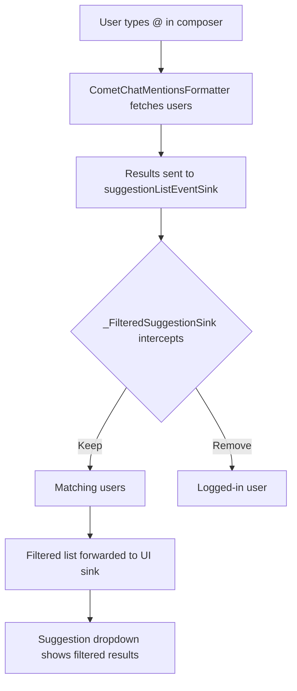

<Accordion title="AI Agent Component Spec">

| Field | Value |
| --- | --- |
| Package | `cometchat_chat_uikit` |
| Key class | `CometChatMentionsFormatter` (from `cometchat_uikit_shared`) |
| Init | `CometChatUIKit.init(uiKitSettings)` then `CometChatUIKit.login(uid)` |
| Purpose | Customize @mention suggestion behavior — filter who appears, style mentions, handle taps |
| Version | v5.2.13 |
| Sample app | [GitHub](https://github.com/cometchat/cometchat-uikit-flutter/tree/v5/sample_app) |
| Related | [Mentions Formatter](/ui-kit/flutter/mentions-formatter-guide) · [Custom Text Formatter](/ui-kit/flutter/custom-text-formatter-guide) · [All Guides](/ui-kit/flutter/guide-overview) |

</Accordion>

This guide walks you through creating a custom mentions formatter that extends `CometChatMentionsFormatter` to control the `@mention` suggestion behavior inside the message composer — letting you filter who appears in the suggestion list, customize mention styling, and handle tap interactions. This works with both `CometChatMessageComposer` and `CometChatCompactMessageComposer`.

<Warning>
This guide requires `cometchat_chat_uikit` version **5.2.13** or above. Earlier versions do not expose the APIs needed to subclass `CometChatMentionsFormatter` in this way.
</Warning>

## Setup

Before implementing a custom mentions formatter, integrate the CometChat Flutter UI Kit into your application. Follow the official [Flutter UI Kit integration guide](https://www.cometchat.com/docs/ui-kit/flutter/5.x/integration) to:

- Create a CometChat account and obtain your App ID, Region, and Auth Key
- Add the `cometchat_chat_uikit` dependency to your `pubspec.yaml`
- Initialize the SDK with `CometChatUIKit.init()` and log in a user with `CometChatUIKit.login()`

---

## Use Case

Filter the logged-in user out of the `@mention` suggestion list so users don't see themselves when typing `@`. The same pattern applies to any custom filtering, styling, or tap-handling logic you need.

---

## How It Works



The key idea: wrap the `suggestionListEventSink` with a filtering proxy so every suggestion list emitted by the base class is automatically transformed before reaching the UI.

---

## Steps

### 1. Create the Formatter Class

Create a new file `lib/utils/custom_mentions_formatter.dart`. Your class extends `CometChatMentionsFormatter` and wraps the suggestion sink before the parent starts using it.

<Tabs>
<Tab title="custom_mentions_formatter.dart">
```dart
import 'dart:async';
import 'package:cometchat_chat_uikit/cometchat_chat_uikit.dart';
import 'package:flutter/material.dart';

/// Custom mentions formatter that filters out the logged-in user
/// from suggestions.
///
/// Wraps the parent's [suggestionListEventSink] with a filtering
/// proxy so that every suggestion list emitted by the base class
/// automatically excludes the currently logged-in user.
class CustomMentionsFormatter extends CometChatMentionsFormatter {
  CustomMentionsFormatter({
    super.trackingCharacter,
    super.pattern,
    super.showLoadingIndicator,
    super.onSearch,
    super.onError,
    super.message,
    super.messageBubbleTextStyle,
    super.messageInputTextStyle,
    super.composerId,
    super.suggestionListEventSink,
    super.previousTextEventSink,
    super.user,
    super.group,
    super.groupMembersRequestBuilder,
    super.usersRequestBuilder,
    super.mentionsType,
    super.onMentionTap,
    super.visibleIn,
    super.style,
    super.disableMentions,
    super.disableMentionAll,
    super.mentionAllLabel,
    super.mentionAllLabelId,
    super.mentionsLimit,
  });

  bool _sinkWrapped = false;

  /// Wraps the sink once before the parent starts using it.
  /// Re-wraps if the controller has reassigned a new sink.
  void _ensureSinkWrapped() {
    final currentSink = super.suggestionListEventSink;
    if (currentSink == null) return;

    // Wrap the raw sink from the controller.
    suggestionListEventSink = _FilteredSuggestionSink(currentSink);
    _sinkWrapped = true;
  }

  @override
  Future<void> initializeFetchRequest(
    String? searchKeyword,
    TextEditingController textEditingController,
  ) async {
    _ensureSinkWrapped();
    await super.initializeFetchRequest(
      searchKeyword,
      textEditingController,
    );
  }

  @override
  Future<void> fetchItems({
    bool firstTimeFetch = false,
    required TextEditingController textEditingController,
    String? searchKeyword,
  }) async {
    _ensureSinkWrapped();
    await super.fetchItems(
      firstTimeFetch: firstTimeFetch,
      textEditingController: textEditingController,
      searchKeyword: searchKeyword,
    );
  }

  @override
  void resetMentionsTracker() {
    _ensureSinkWrapped();
    super.resetMentionsTracker();
  }
}
```

</Tab>
</Tabs>

### 2. Create the Filtering Sink

In the same file, add a private `StreamSink` wrapper. This is the piece that actually filters the suggestions — in this example it removes the logged-in user.

<Tabs>
<Tab title="Dart">
```dart
/// A [StreamSink] wrapper that removes the logged-in user from every
/// suggestion list before forwarding it to the real sink.
class _FilteredSuggestionSink
    implements StreamSink<List<SuggestionListItem>> {
  final StreamSink<List<SuggestionListItem>> _delegate;

  _FilteredSuggestionSink(this._delegate);

  @override
  void add(List<SuggestionListItem> data) {
    final loggedInUid = CometChatUIKit.loggedInUser?.uid;

    if (loggedInUid == null || loggedInUid.isEmpty) {
      _delegate.add(data);
      return;
    }

    _delegate.add(
      data.where((item) => item.id != loggedInUid).toList(),
    );
  }

  @override
  void addError(Object error, [StackTrace? stackTrace]) =>
      _delegate.addError(error, stackTrace);

  @override
  Future addStream(Stream<List<SuggestionListItem>> stream) =>
      _delegate.addStream(stream);

  @override
  Future close() => _delegate.close();

  @override
  Future get done => _delegate.done;
}
```

</Tab>
</Tabs>

### 3. Use It in the Composer Widgets

Your custom formatter works with both composer widgets via the `textFormatters` parameter.

<Note>
When the UI Kit detects a custom subclass of `CometChatMentionsFormatter` in `textFormatters`, it automatically removes the default one so they don't conflict. You don't need to manually disable the built-in formatter.
</Note>

<Tabs>
<Tab title="CometChatMessageComposer">
```dart
import 'package:your_app/utils/custom_mentions_formatter.dart';

CometChatMessageComposer(
  user: user,       // pass user for 1-on-1 chats
  group: group,     // pass group for group chats
  textFormatters: [
    CustomMentionsFormatter(
      user: user,
      group: group,
      onMentionTap: (mention, mentionedUser, {message}) {
        if (mentionedUser.uid != CometChatUIKit.loggedInUser!.uid) {
          // Navigate to your own user profile screen
          debugPrint('Mentioned user: ${mentionedUser.name}');
        }
      },
    ),
  ],
  disableMentions: false,
  parentMessageId: 0, // non-zero for thread replies
)
```

</Tab>

<Tab title="CometChatCompactMessageComposer">
```dart
import 'package:your_app/utils/custom_mentions_formatter.dart';

CometChatCompactMessageComposer(
  user: user,
  group: group,
  textFormatters: [
    CustomMentionsFormatter(
      user: user,
      group: group,
      onMentionTap: (mention, mentionedUser, {message}) {
        if (mentionedUser.uid != CometChatUIKit.loggedInUser!.uid) {
          // Navigate to your own user profile screen
          debugPrint('Mentioned user: ${mentionedUser.name}');
        }
      },
    ),
  ],
  disableMentions: false,
  parentMessageId: 0,
)
```

</Tab>

<Tab title="Switching at Runtime">
Create the formatter once and reuse it for either composer:

```dart
Widget buildComposer() {
  final mentionsFormatter = CustomMentionsFormatter(
    user: user,
    group: group,
    onMentionTap: (mention, mentionedUser, {message}) {
      if (mentionedUser.uid != CometChatUIKit.loggedInUser!.uid) {
        // navigate to user profile
      }
    },
  );

  if (useCompactComposer) {
    return CometChatCompactMessageComposer(
      user: user,
      group: group,
      textFormatters: [mentionsFormatter],
      disableMentions: false,
    );
  } else {
    return CometChatMessageComposer(
      user: user,
      group: group,
      textFormatters: [mentionsFormatter],
      disableMentions: false,
    );
  }
}
```

</Tab>
</Tabs>

---

## Key Concepts

| Concept | What It Means |
| --- | --- |
| `CometChatMentionsFormatter` | The base class that handles `@mention` behavior. Extend this to customize. |
| `CometChatTextFormatter` | The parent of `CometChatMentionsFormatter`. All text formatters (email, phone, mentions) extend this. |
| `CometChatMessageComposer` | The standard (normal) message composer widget. Accepts `textFormatters`. |
| `CometChatCompactMessageComposer` | A slimmer composer with rich text editing. Also accepts `textFormatters` in the same way. |
| `textFormatters` | A list of formatters passed to either composer. Both composers handle custom mentions formatters identically. |
| `suggestionListEventSink` | A `StreamSink` that receives the suggestion list data. Wrapping it lets you filter/transform suggestions. |
| `SuggestionListItem` | Each item in the mention suggestion dropdown. Has an `id` field you can use for filtering. |
| `trackingCharacter` | The character that triggers the suggestion list. Defaults to `@`. |
| `onMentionTap` | Callback fired when a user taps on a mention in a message bubble. |

---

## Common Customization Ideas

### Filter by Role

You can filter based on the `data` map attached to each `SuggestionListItem`. For example, if user metadata includes a role:

```dart
_delegate.add(
  data.where((item) => item.data?['role'] != 'admin').toList(),
);
```

### Limit Suggestion Count

```dart
_delegate.add(data.take(5).toList());
```

### Custom Mention Styling

```dart
CustomMentionsFormatter(
  style: CometChatMentionsStyle(
    mentionSelfTextColor: Colors.orange,
    mentionTextColor: Colors.blue,
    mentionTextBackgroundColor: Colors.blue.withOpacity(0.1),
  ),
)
```

---

## Troubleshooting

| Problem | Solution |
| --- | --- |
| Suggestions still show the logged-in user | Make sure you're passing `CustomMentionsFormatter` (not the base class) in `textFormatters`. |
| Suggestion list doesn't appear at all | Check that `disableMentions` is not set to `true`. Verify the `user` or `group` parameter is provided. |
| `onMentionTap` not firing | Ensure you're passing the callback when constructing the formatter, not on a separate default formatter. |
| Two suggestion lists appearing | You may be passing both a custom and default `CometChatMentionsFormatter`. The UI Kit handles deduplication automatically, but double-check your `textFormatters` list. |

---

## Next Steps

<CardGroup cols={2}>
  <Card title="Mentions Formatter" href="/ui-kit/flutter/mentions-formatter-guide">
    Configure the built-in mentions formatter.
  </Card>
  <Card title="Custom Text Formatter" href="/ui-kit/flutter/custom-text-formatter-guide">
    Build custom inline text patterns with regex.
  </Card>
  <Card title="Message Composer" href="/ui-kit/flutter/message-composer">
    Customize the standard message input component.
  </Card>
  <Card title="Compact Message Composer" href="/ui-kit/flutter/compact-message-composer">
    Customize the compact message input component.
  </Card>
</CardGroup>
